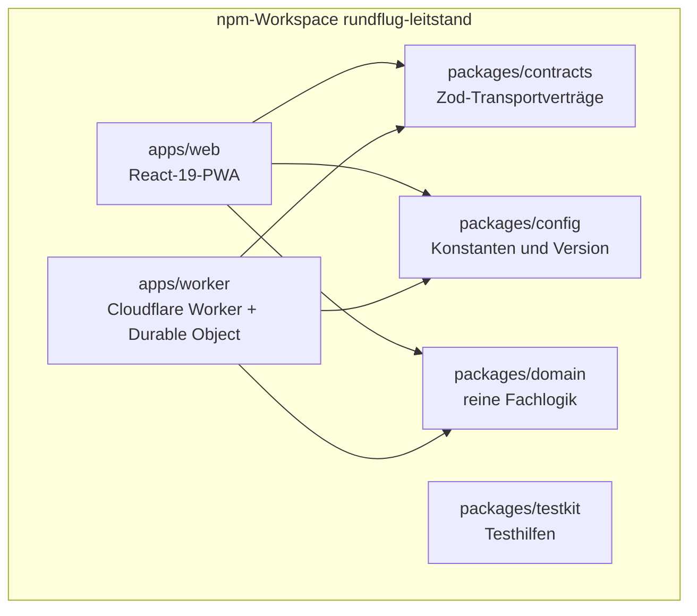
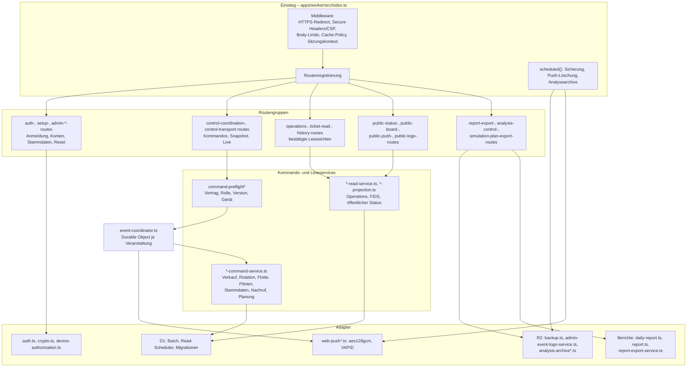
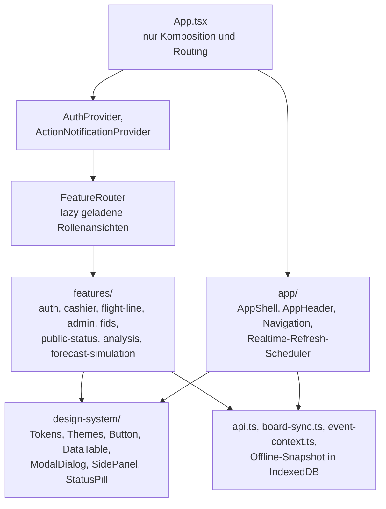
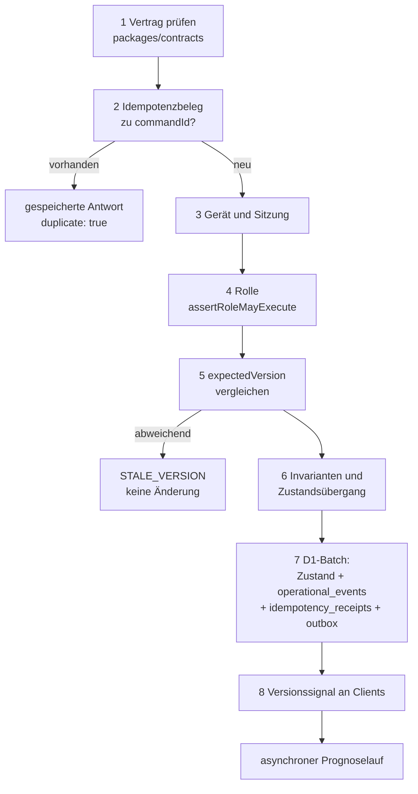

# 5. Bausteinsicht

## 5.1 Ebene 1 – Gesamtsystem

`packages/domain` besitzt keine Abhängigkeit (auch keine Entwicklungsabhängigkeit auf Cloudflare, HTTP
oder React), `packages/contracts` ausschließlich Zod. Die Webanwendung verwendet die Fachlogik nur
lesend – für Anzeige, Projektionen und den lokalen Prognosesimulator; bestätigte Zustandsübergänge
entstehen ausschließlich im Worker.

| Baustein | Verantwortung | Bewusste Grenze |
| --- | --- | --- |
| `apps/web` | Bedienoberflächen aller Rollen, öffentliche Statusseiten, PWA-Verhalten, Offline-Sichtbarkeit, Prognosesimulator | führt keine fachlichen Zustandsübergänge aus; kennt keine D1- oder Cloudflare-Details |
| `apps/worker` | HTTP- und WebSocket-Transport, Sitzungen und Rollenprüfung, Persistenz, Serialisierung, Prognoseanstoß, Push, Backups, Cron | dupliziert keine Domänenregel; einziger Ort für Cloudflare-Bindings |
| `packages/contracts` | ausführbare Verträge für Kommandos, Antworten, öffentliche DTOs, Exporte und Vorlagen | enthält keine Geschäftsentscheidung, nur Form und Validierung |
| `packages/domain` | Rollenrechte, Zustandsautomaten, Invarianten, Queue, Prognose, Kapazität, Nacherfassung | keine Laufzeitabhängigkeit, kein Import von Cloudflare, HTTP, DB oder React |
| `packages/config` | Anwendungsname, Version aus der Root-`package.json`, Standardzeitzone | keine Logik |
| `packages/testkit` | eigenständige synthetische Testuhr und technische Testkennungen | nicht Teil des Produktionsbundles; derzeit ohne Workspace-Konsumenten |

Die Grenze wird maschinell geprüft: `apps/worker/src/maintainability-coverage.test.ts` kontrolliert
Abhängigkeits-Allowlist und Domain-Reinheit, `npm run refactor:guardrails` zusätzlich Dateibudgets und
verbotene Importmuster.

## 5.2 Ebene 2 – Worker

| Baustein | Aufgabe |
| --- | --- |
| `index.ts` | komponiert Middleware, registriert alle Routengruppen, exportiert `EventCoordinator` und den Cron-Handler; enthält selbst keine Fachlogik |
| `control-coordination-routes.ts` | Kommandoannahme; leitet an das zuständige Durable Object weiter (`jurisdiction("eu")` außerhalb der Entwicklung) |
| `control-transport-routes.ts` | WebSocket-Upgrade für `/api/control/:eventId/live` |
| `command-preflight*.ts` | prüft Transportvertrag, Sitzung, Rolle, Gerätekopplung und erwartete Version vor der Fachlogik |
| `event-coordinator.ts` | serialisiert Kommandos je Veranstaltung, orchestriert D1-Batch, Auditereignis, Idempotenzbeleg und Outbox, stößt Prognose an, verteilt Versionssignale, bedient Alarm für Prognosetakt und Nachrufablauf |
| `*-command-service.ts` | fachlich abgegrenzte Schreiboperationen (Verkauf, Rotation, Flotte, Pilotenzuweisung, Stammdaten, Nachruf, Planung, Nacherfassung) |
| `*-read-service.ts`, `*-projection.ts` | berechtigungsabhängige Lesesichten: operative Vollsicht, FIDS-Board, öffentlicher Ticket-/Gruppenstatus |
| `forecast-timeline-service.ts` | Prognoselauf, Snapshots, Voraufrufentscheidungen |
| `backup.ts`, `admin-event-logo-service.ts`, `analysis-archive*.ts` | portable Sicherungen, Veranstaltungslogos und Analysepakete in R2 |
| `daily-report.ts`, `report.ts`, `report-export-service.ts` | erzeugen CSV- und PDF-Tagesberichte bei Abruf aus dem bestätigten D1-Zustand |
| `web-push*.ts` | Verschlüsselung, VAPID-Signatur, Zustellwarteschlange, Löschfristen |
| `auth.ts`, `crypto.ts`, `device-authorization.ts` | Sitzungen, PIN-Hash, Gerätekopplung, Ratenbegrenzung sensibler Pfade |
| `transport-security.ts`, `request-body-boundaries.ts`, `api-cache-policy.ts` | HTTPS-Erzwingung, Body-Grenzen, Cache-Header |

## 5.3 Ebene 2 – Webanwendung

| Feature-Modul | Inhalt |
| --- | --- |
| `auth` | Anmeldung, Kontenverwaltung, veranstaltungsbezogener Anwendungskontext |
| `cashier` | Verkauf, Produktreihenfolge, Ticketstatus-Abgleich, Druckvorbereitung |
| `flight-line` | Flight-Line-Bedienung sowie Flight-Director-Analytik und Betriebsdialoge |
| `admin` | Stammdaten, Veranstaltungsparameter, Abschluss, Werksreset, Auswertung |
| `fids` | Board, Einstellungsdialog, Live- und Simulationsdatenquelle |
| `public-status` | Ticket- und Gruppenstatus, Push-Einwilligung, öffentliche Texte |
| `analysis` | Diagnose-Momentaufnahmen und clientseitige Auswertung |
| `forecast-simulation` | lokaler Prognosesimulator, ausschließlich im Browser |

Verbindliche Regeln dieser Ebene (Q-WAR-060): `App.tsx` enthält ausschließlich Komposition und
Routing. Rollenansichten werden lazy geladen, damit ein Monitor nicht den Verwaltungscode lädt. Der
API-Zugriff liegt gebündelt in `api.ts` und den Feature-Clients; Komponenten führen keine fachlichen
Zustandsübergänge selbst aus. Der Prognosesimulator arbeitet ausschließlich im Browser und schreibt
keine Daten in D1, R2 oder Durable Objects.

## 5.4 Ebene 3 – Fachlogik `packages/domain`

| Modul | Inhalt |
| --- | --- |
| `index.ts` | Rollen (`CASHIER`, `FLIGHT_LINE`, `FLIGHT_DIRECTOR`, `ADMIN`, `DISPLAY`), `assertRoleMayExecute`, Kommandotypen, `transitionRotation`, Gruppenschutz, Verkaufsschutz |
| `queue.ts` | Queue-Ordnung ganzer Buchungsgruppen, `planNextRotations`, produkt- und gatereine Batches |
| `forecast.ts` | Lernen aus abgeschlossenen Umläufen, Gewichtung, Ausreißerfilter, Qualitätsstufen, Überfälligkeitskorrektur |
| `dispatch-plan.ts` | begrenzte kombinatorische Dispatch-Planung mit Durchsatz- und Fairnesszielen |
| `capacity.ts` | `assessMarginalProductCapacity`: konservative Restkapazität je Produkt (`AVAILABLE`, `LIMITED`, `MANUAL_REVIEW`, `SOLD_OUT`) |
| `turnaround.ts`, `reference-rotation.ts` | komponentenweise Umlaufzeit aus Flugzeug + Produkt, Produkt und Veranstaltung |
| `precall.ts` | automatischer Voraufruf und dessen Rücknahmebedingungen |
| `operational-plan.ts`, `recurring-operational-rule.ts` | weicher Betriebsplan und wiederkehrende Regeln als reine Prognoseeingänge |
| `outage-recovery.ts` | Papier-Nacherfassung mit Simulation, Konfliktprüfung und Vier-Augen-Freigabe |
| `public-status.ts`, `public-forecast.ts`, `fids.ts`, `communication-labels.ts` | reduzierte, handlungsorientierte öffentliche Projektionen und einheitliche Statusbegriffe |
| `ticket-group-recall.ts` | eigenständiger aktiver Gruppennachruf ohne Eingriff in die Ticketzustandsmaschine |

## 5.5 Ebene 3 – Kommandopipeline im `EventCoordinator`

Die Reihenfolge ist verbindlich. Ein abgewiesenes Kommando verändert weder Fachzustand noch
Ereignisprotokoll, und es wird niemals vor erfolgreicher Persistenz veröffentlicht.
