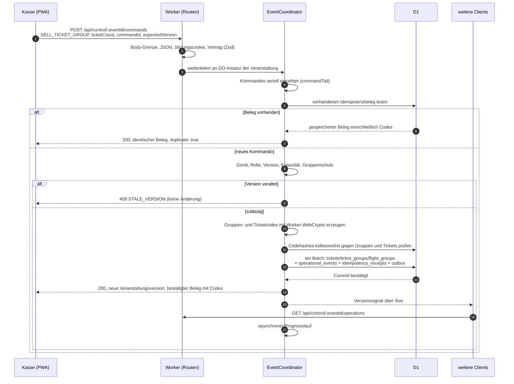
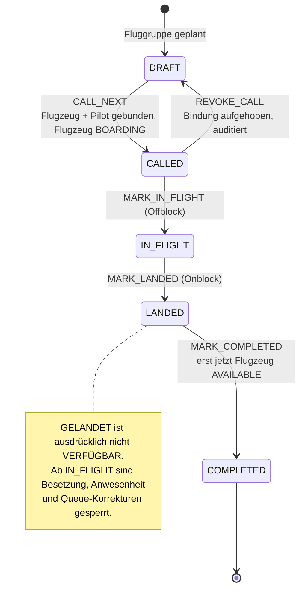
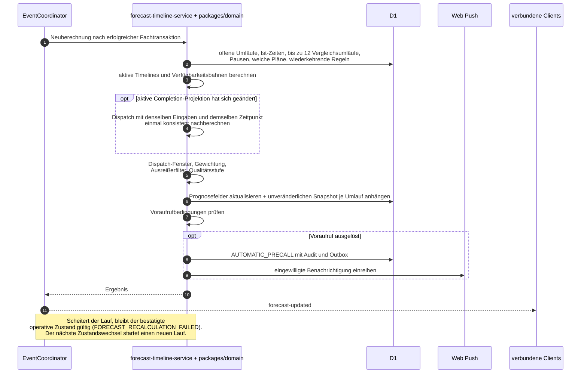
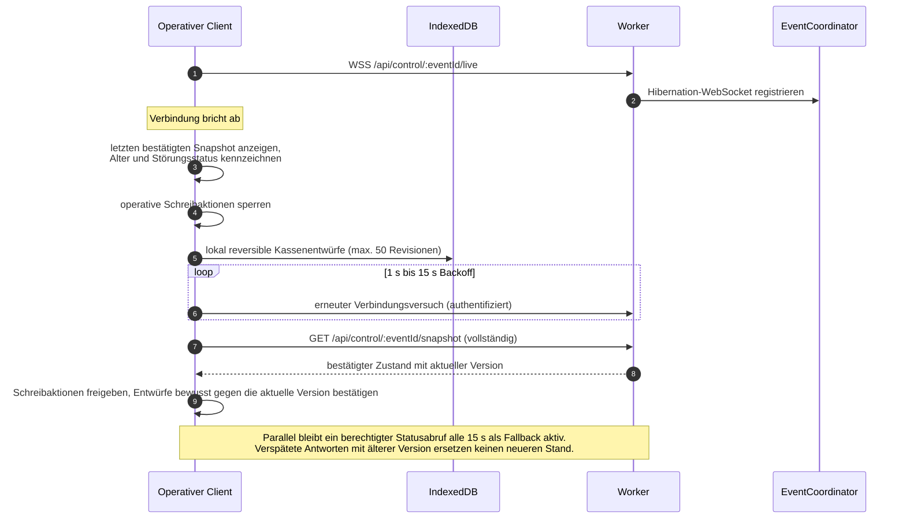
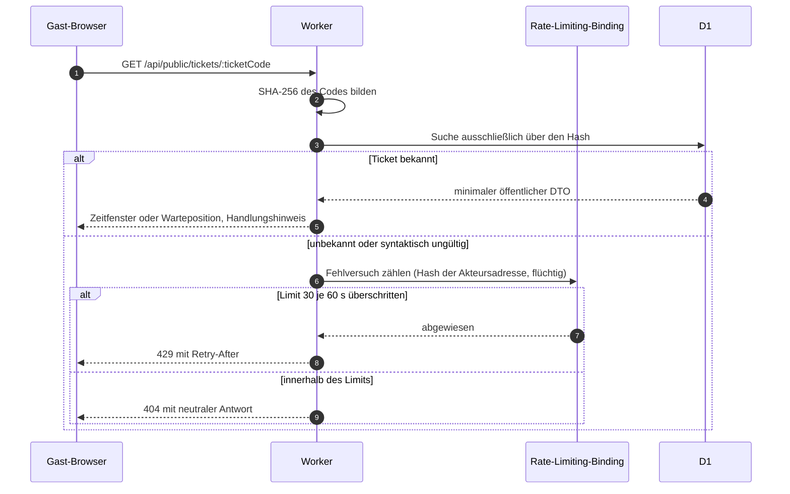
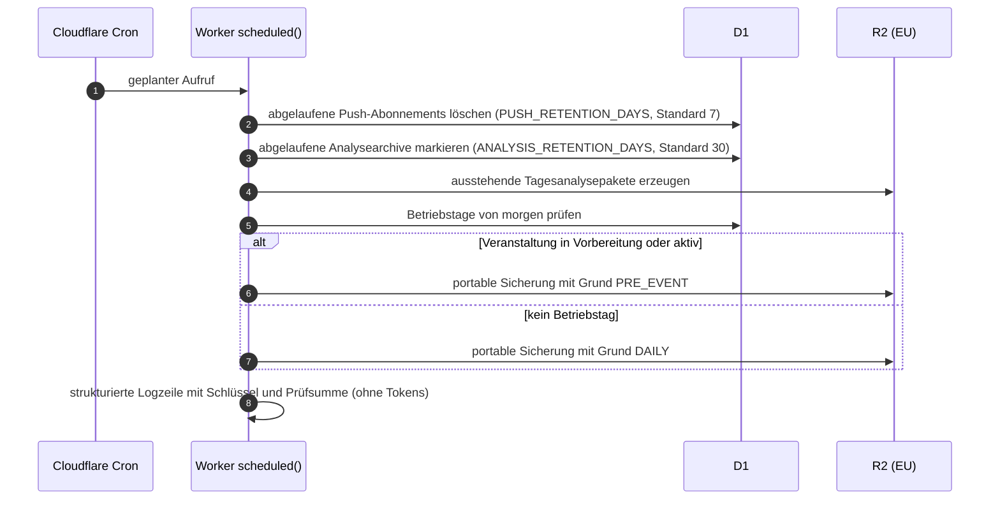
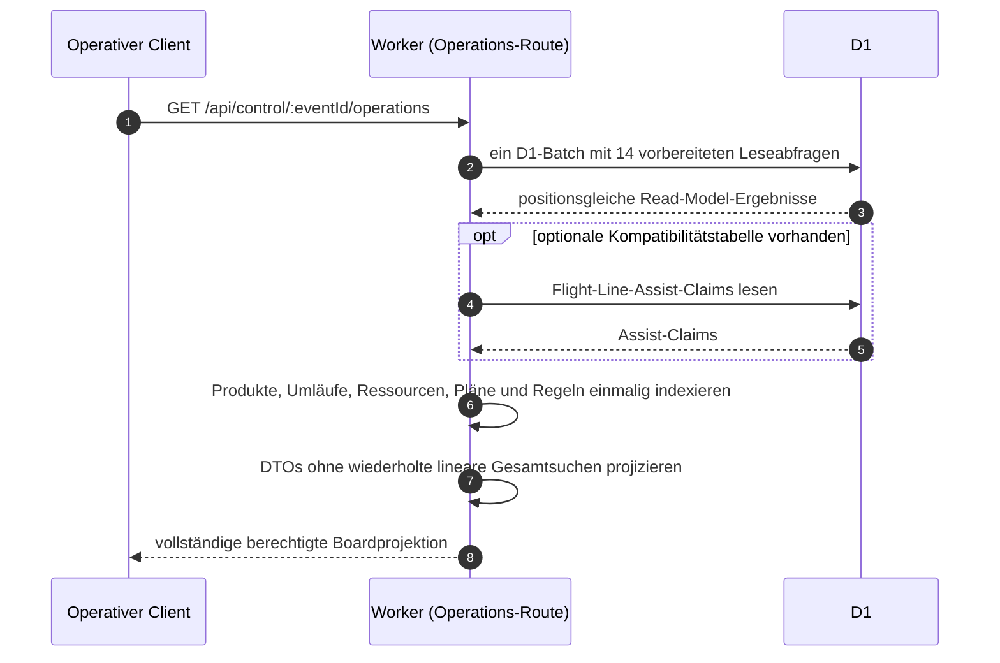
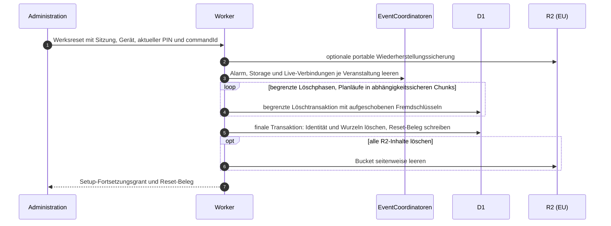

# 6. Laufzeitsicht

## 6.1 Schreibkommando: Verkauf an der Kasse

Wesentlich: Die Antwort an die Kasse erfolgt erst nach dem Commit. Erst danach erfahren andere
Geräte, dass eine neue Version existiert, und laden ihre jeweils berechtigte Sicht. Der Ticketdruck
verwendet die bereits bestätigte Antwort. Die PWA wählt keine öffentlichen Codes; eine Wiederholung
derselben `commandId` liest den zuerst gespeicherten Beleg, bevor neue Codes erzeugt würden.

## 6.2 Umlauf an der Flight Line

Der automatische Voraufruf (`AUTOMATIC_PRECALL`, öffentlich „Bitte zum Gate“) läuft vor `CALL_NEXT`
und bindet weder Flugzeug noch Pilotencode; er ist bis zur bewussten Bestätigung reversibel.

## 6.3 Prognoselauf nach einem bestätigten Ereignis

Der Prognoselauf verändert keine bestätigten Ist-Ereignisse. Zusätzlich taktet der
Durable-Object-Alarm die Neuberechnung alle 30 Sekunden und beendet fällige Gruppennachrufe über
dieselbe serielle Kommandogrenze.

Die einmalige interne Nachberechnung verhindert, dass ein durch Debouncing zusammengefasster
Commandlauf einen Dispatch-Vorschlag noch aus den zuvor gespeicherten Completion-Zeiten aktiver
Flugzeuge oder Piloten ableitet. Beide Rechenschritte verwenden denselben geladenen Zustand und
denselben Berechnungszeitpunkt; nur der konvergierte Endstand wird persistiert, als Analysepaket
erfasst und veröffentlicht.

## 6.4 Verbindungsverlust und Wiederaufnahme

Operativ wirksame Kommandos werden offline nicht angenommen (OQ-01): Verkauf, Storno, Neuverkauf nach
Korrektur, Boardingstart, `IM FLUG`, `GELANDET`, `ABGESCHLOSSEN`, Not-Halt und Stammdatenänderungen
benötigen eine Serverbestätigung und werden bei fehlender Verbindung sichtbar gesperrt.

## 6.5 Öffentlicher Ticketstatus

Erfolgreiche Abrufe verbrauchen das Fehlversuchslimit nicht. Weder Adresse noch Hash werden in D1, im
Auditprotokoll oder in Anwendungslogs gespeichert.

## 6.6 Nächtlicher Wartungslauf (Cron `15 2 * * *`)

## 6.7 Ausfall und Papier-Nacherfassung

Bei einem Totalausfall der Verbindung arbeitet die Veranstaltung nach der dokumentierten
Papier-Rückfallebene weiter. Nach dem Wiederanlauf wird ein Nacherfassungsbatch angelegt und
durchläuft `STAGED`/`CONFLICTED` → `APPROVED` (Vier-Augen-Prinzip) → `APPLIED`. Simulation und
Anwendung prüfen erneut die Veranstaltungsversion; doppelte Belegfolgen, doppelte Ticketcodes,
zukünftige Zeitpunkte, fehlende Referenzen und ungültige Umlaufübergänge blockieren den gesamten
Batch, statt Teilzustände zu erzeugen.

## 6.8 Lesen und Projizieren des Operations-Boards

Der Normalpfad benötigt für die 14 unabhängigen Kernabfragen genau einen D1-Roundtrip. Die optionale
Assist-Claims-Abfrage bleibt bis zum Ende ihres Kompatibilitätsfensters getrennt. Fehlt in einem
älteren Schema `gates.display_filter_json`, wird der vollständige Read-Batch einmal mit der
kompatiblen Leerprojektion wiederholt; andere Fehler werden nicht verschluckt. Die Projektion baut
vor der DTO-Erzeugung Lookup- und Gruppierungsindizes auf und verändert weder Fachregeln noch den
bestätigten D1-Zustand.

## 6.9 Vollständiger Werksreset

Eine fehlgeschlagene Bulk-Phase kann bereits geleerte Nutzdatentabellen hinterlassen, löscht aber
noch nicht den Administratorzugang. Der zulässige Forward-Repair ist die Wiederholung des
Werksresets; die finale Transaktion erzeugt den idempotenten Beleg erst nach vollständigem
D1-Abschluss. ADR-0050 begründet diese Abweichung von einem einzigen, bei großen Historien nicht
ausführbaren D1-Batch.
