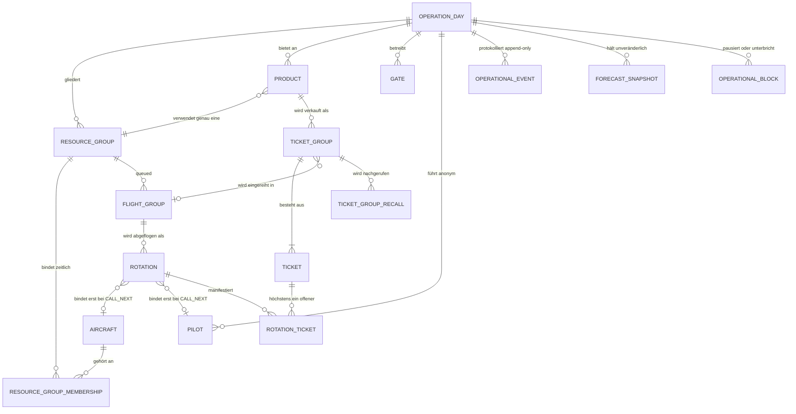

# 8. Querschnittliche Konzepte

## 8.1 Fachliches Domänenmodell

Aggregatgrenzen und tragende Invarianten:

- Die Veranstaltung (`operation_days`) ist das äußere Aggregat und trägt die
  Nebenläufigkeitsversion, gegen die jedes Kommando prüft. Ressourcengruppe, Fluggruppe, Umlauf und
  Ticketgruppe besitzen zusätzlich eigene Versionen.
- Ein Produkt verwendet genau eine Ressourcengruppe (nicht nullbarer Fremdschlüssel); die operative
  Planzeit liegt ausschließlich am Produkt.
- Ein Flugzeug gehört zu einem Zeitpunkt höchstens einer aktiven Ressourcengruppe – abgesichert durch
  den partiellen Unique-Index `uq_aircraft_one_active_resource_group`.
- Ein Ticket steht in höchstens einem nicht abgeschlossenen Umlauf (`uq_ticket_one_active_rotation`).
- Die Fluggruppennummer (`communication_number`) ist je Veranstaltung und Ressourcengruppe eindeutig
  und bleibt eine reine Kommunikationskennung – keine Uhrzeitzusage und keine Flugzeugbindung.
- Buchungsgruppen werden niemals automatisch getrennt; eine sichtbar ausgewiesene Aufteilung entsteht
  nur durch die bewusste Verkaufsaktion.

Vollständige Automaten, Übergangstabellen und die Zuordnung zu Datenbanksicherungen stehen in
`docs/architecture/domain-state-and-forecast-v1.md` und `docs/architecture/ticket-states-v1.md`.

## 8.2 Kommando-, Idempotenz- und Versionskonzept

Jedes Schreibkommando trägt mindestens `commandId`, `eventId`, `deviceId`, `expectedVersion`,
`issuedAt`, den typisierten Kommandonamen und dessen Nutzdaten. Verbindliche Eigenschaften:

- **Idempotenz:** eine wiederholte `commandId` liefert die gespeicherte Antwort mit `duplicate: true`.
  Doppel-Tipps auf Tablets erzeugen dadurch keine zweite Wirkung.
- **Optimistische Nebenläufigkeit:** abweichende Version ergibt `STALE_VERSION`; ein veralteter Stand
  überschreibt niemals still einen neueren.
- **Eine Konsistenzgrenze:** Zustandsänderung, `operational_events`, `idempotency_receipts` und
  `outbox` werden in derselben D1-Batchgrenze geschrieben.
- **Veröffentlichung nach Commit:** das Versionssignal wird erst nach erfolgreicher Persistenz
  gesendet.
- **Ein Schreibpfad:** zusätzliche Datenquellen (Wetter, ADS-B, spätere Integrationen) werden als
  Adapter vor demselben Kommandoeingang ergänzt und dürfen weder Tabellen direkt ändern noch
  Domänenregeln im Transportcode duplizieren.

## 8.3 Persistenz und Migrationen

- D1 ist die relationale Source of Truth; das Durable Object darf flüchtigen Cache halten, aber
  keinen ausschließlich dort vorhandenen fachlichen Zustand.
- Die fortlaufenden SQL-Migrationen unter `apps/worker/migrations/` sind ausschließlich additiv. Jede Migration mit
  operativer Wirkung besitzt eine Notiz in `docs/operations/backup-restore.md` beziehungsweise ein
  eigenes Migrationsdokument.
- Tabellen sind `STRICT`; fachliche Invarianten werden zusätzlich durch `CHECK`-Bedingungen,
  Fremdschlüssel und partielle Unique-Indizes abgesichert.
- `operational_events` und `forecast_snapshots` sind append-only; D1-Trigger verbieten `UPDATE` und
  `DELETE`. Korrekturen entstehen als neue Ereignisse.
- Der `d1-read-scheduler` bündelt unabhängige Leseabfragen als typisierte D1-Batches. Das
  Operations-Board lädt seine 14 Kernmodelle in einem Batch; positionsgleiche Projektoren erhalten
  dabei die konkreten Resultattypen. Kompatibilitätsabfragen bleiben explizit getrennt.
- Master-Data-Templates prüfen bis zu 200 Flugzeugregistrierungen mit einer parametrierten
  `json_each`-Abfrage statt mit einem Lookup je Registrierung.
- Boardprojektionen indexieren wiederverwendete Produkte, Umläufe, Ressourcen, Pläne und Regeln
  einmalig in Maps. Wiederholte lineare Gesamtsuchen innerhalb von Rotations- und
  Ressourcengruppenschleifen sind dadurch ausgeschlossen.
- Portable Backups werden als Format 2 seitenweise aus D1 gelesen und als ZIP mit einem
  Tabellenmanifest sowie NDJSON-Dateien geschrieben. Ein Archivstrom, ein 500-Zeilen-D1-Fenster und
  höchstens ein 5-MiB-R2-Multipart-Teil begrenzen den Speicherbedarf. SHA-256 entsteht inkrementell
  über die übertragenen Archivbytes; das getrennte Sidecar ist zwingende Restore-Voraussetzung.
  Der isolierte Restore akzeptiert während der dokumentierten Übergangsfrist weiterhin Format 1.

## 8.4 Echtzeit, Offline und degradierter Betrieb

- WebSockets laufen mit der Hibernation-API; übertragen wird ausschließlich das Versionssignal.
- Nach Wiederverbindung erhält ein Client zuerst einen vollständigen Snapshot, danach Signale.
- Polling alle 15 Sekunden bleibt Fallback; Backoff bei Verbindungsversuchen 1 s bis 15 s.
- Der letzte bestätigte Snapshot bleibt bei Störungen sichtbar und wird mit Alter und Störungsstatus
  gekennzeichnet; ein Fehler leert die Oberfläche nicht.
- Schreibaktionen bleiben bis zur nächsten Serverbestätigung gesperrt. Nur lokal reversible
  Kassenentwürfe werden in einer auf 50 Revisionen begrenzten Draft-Queue gehalten und niemals
  automatisch gesendet.
- Notfallmodus und organisatorische Unterbrechung sind eigene, auditierte Zustände; sie unterdrücken
  scheinpräzise öffentliche Prognosen, ohne die Historie zu verändern.

## 8.5 Prognose, Dispatch und Kapazität

- Getrennte Zeitarten: Planzeit (einmalig abgeleitet), Prognosezeit (neu berechnet), Ist-Zeit
  (ausschließlich aus bestätigten Kommandos).
- Referenz-Umlaufzeit = Boardingzeit + Referenzzeit Offblock–Onblock + Ausstiegszeit + betrieblicher
  Puffer; komponentenweise aufgelöst über Flugzeug + Produkt, Produkt und Veranstaltung.
- Gelernt wird nur aus `COMPLETED`-Umläufen; jüngere Messungen erhalten höheres Gewicht, Ausreißer
  werden über Median Absolute Deviation begrenzt.
- Qualitätsstufen `STABLE`, `CHANGING` und `UNCERTAIN` steuern die Intervallbreite und verhindern
  scheinpräzise öffentliche Aussagen.
- Nahe Fluggruppen erhalten einen begrenzten kombinatorischen Dispatch-Plan (versionierte
  Empfehlung), alle übrigen werden deterministisch linear auf die früheste kompatible
  Verfügbarkeitsbahn gelegt.
- `assessMarginalProductCapacity` liefert die konservative Verkaufsfreigabe je Produkt; sie ist eine
  organisatorische Hilfe ohne Freigabewirkung.
- Der lokale Browser-Simulator verwendet für Legacy- und importierte Betriebsszenarien dieselben
  deterministischen Seed-, PRNG-, Stichproben- und Zeitprimitive. Seine feste Tick-Reihenfolge
  Lifecycle → Precall → Dispatch → Snapshot sowie Golden-Seed-Sequenzen machen Replay-Ergebnisse
  über Refactorings hinweg reproduzierbar.
- Der Worker verarbeitet jeden Lauf als gerichtete Pipeline: D1-Loader → reiner Eingabe-Projector →
  Domain-Projektion → reiner Precall-Evaluator → D1-Repository → Push/WebSocket-Publikation.
  Persistenz und Audit/Outbox liegen vor jeder extern sichtbaren Veröffentlichung.
- Der interne Legacy-Vergleichspfad erhält keine neuen Fachregeln. ADR-0041 definiert seinen
  synthetischen Replay-Nachweis und die Bedingungen für seine Entfernung.
- Details: `docs/architecture/dispatch-planning-v1.md`, `docs/architecture/forecast-sample-policy-v1.md`
  und `docs/architecture/forecast-snapshots-v1.md` sowie ADR-0041 und ADR-0042.

## 8.6 Sicherheit und Zugriffsschutz

| Schutzziel | Umsetzung |
| --- | --- |
| Transport | HTTPS/TLS erzwungen (308-Redirect außerhalb der Entwicklung), WSS für Realtime |
| Anmeldung | Konten mit Rolle; Sitzungen über Secure-/HttpOnly-/SameSite-Cookies, nicht aus JavaScript lesbar, Inaktivitätssperre und absolute Befristung |
| PIN | langsamer, gesalzener Passwort-Hash; progressive Begrenzung der Fehlversuche je Konto und Herkunft |
| Rollenrechte | `assertRoleMayExecute` in `packages/domain`; jedes Kommando ist genau einer Rollenmenge zugeordnet |
| Geräte | gekoppelte Geräte mit gehashtem Kopplungstoken; Klartexttoken bleibt lokal im Browser |
| Öffentliche Endpunkte | Hash-Lookup, neutrale Fehlerantworten, Rate-Limiting-Bindings (30/60 s öffentlich, 5/60 s Adminwiederherstellung) |
| Browserhärtung | strikte CSP (`default-src 'self'`, keine externen Skripte), `frame-ancestors none`, `nosniff`, `no-referrer` |
| Eingaben | Body-Größenbegrenzung, verpflichtende JSON-Validierung, Zod-Verträge vor jeder Fachlogik |
| Öffentliche Codes | ausschließlich serverseitige WebCrypto-Vergabe im regulären Verkauf, chargen- und bestandsweite Kollisionsprüfung, 80 Bit Entropie, Rate Limits an öffentlichen Endpunkten |
| Protokollierung | strukturierte Logs ohne Ticketcodes, PINs, Push-Ziele oder Secrets |
| Analyseexporte | ausschließlich typisierte `SUPPORT_SAFE`-Allowlist-Projektionen, private R2-Objekte, keine Tabellendumps |

Rollenmatrix: `CASHIER` verkauft und korrigiert, `FLIGHT_LINE` bestätigt Ist-Ereignisse,
`FLIGHT_DIRECTOR` disponiert und steuert Betriebszustände, `ADMIN` verwaltet Stammdaten, Konten und
Reset, `DISPLAY` besitzt ausschließlich Lesezugriff auf die Boardprojektion.

## 8.7 Datenschutz und Anonymität

- Im Kernsystem existieren keine Gastnamen und keine Telefonnummern; der Betrieb funktioniert
  vollständig ohne personenbezogene Kontaktdaten.
- Öffentliche Ticket- und Gruppencodes entstehen beim regulären Verkauf ausschließlich im Worker.
  Der SHA-256-Hash dient dem öffentlichen Lookup; der Klartext liegt im bestätigten Kassenbeleg, auf
  dem gedruckten Ticket und im geschützten operativen Datensatz für autorisierte Nachdrucke.
- Piloten erscheinen ausschließlich als anonyme Kürzel; die Zuordnung zu realen Personen bleibt
  außerhalb des Systems.
- Push-Abonnements liegen in getrennten Tabellen, sind nicht Teil portabler Sicherungen und werden
  nach `PUSH_RETENTION_DAYS` gelöscht; Einwilligung wird mit Zeitpunkt und Kanal dokumentiert.
- Kein Tracking, keine Werbung, keine externen Analysedienste.
- Vollständiges Verarbeitungsinventar: `docs/operations/privacy-data-inventory-v1.md`; offene
  rechtliche Punkte: `docs/operations/cloudflare-data-protection-acceptance-v1.md` und OQ-06.

## 8.8 Fehlerbehandlung

- Fehler verlassen die API als typisierte Codes (`STALE_VERSION`, `TICKET_NOT_FOUND`,
  `TOO_MANY_TICKET_ATTEMPTS`, `ROLE_NOT_AUTHORIZED`, `ADMIN_PIN_INVALID`, `INVALID_JSON`,
  `INTERNAL_ERROR`) mit deutscher, handlungsorientierter Meldung.
- Ein abgewiesenes Kommando ist wirkungslos: kein Teilzustand, kein Auditeintrag, keine
  Veröffentlichung.
- Fehlgeschlagene Prognoseläufe (`FORECAST_RECALCULATION_FAILED`) lassen den bestätigten operativen
  Zustand unberührt; der nächste bestätigte Zustandswechsel startet einen neuen Lauf.
- Unbehandelte Fehler erzeugen eine strukturierte Logzeile ohne Nutzdaten und eine neutrale
  500-Antwort.
- Die Web-Anwendung besitzt zwei gestaffelte React-Fehlergrenzen: Eine globale Fehlergrenze liegt
  außerhalb der Context-Provider, eine zweite umschließt jeden lazy geladenen Rollenbereich. Beide
  zeigen ausschließlich neutrale Texte ohne technische oder sensitive Fehlerdetails und bieten eine
  explizite Aktion „Neu laden“.
- Beim Fehler erhält die Überschrift den Fokus. Ein Routenwechsel setzt nur die routenbezogene
  Fehlergrenze zurück; die globale Fehlergrenze bleibt der letzte Rückfall für Provider- und
  Initialisierungsfehler. DOM- und Browser-Tests prüfen Darstellung und Wiederherstellung in hellem
  und dunklem Farbschema sowie in Desktop- und Mobilbreite.

## 8.9 Bedienoberfläche und PWA

- Gemeinsames Designsystem mit Tokens, hellem und dunklem Farbschema, einheitlichen Statusbegriffen,
  Farben und Symbolen sowie touchtauglichen Bedienelementen.
- Kasse und Flight Line folgen Ein-Bildschirm-Abläufen ohne Menünavigation; Editoren der
  Administration öffnen erst nach „Neu“ oder „Bearbeiten“ als Drawer oder Dialog.
- Layoutkonstanz ist verbindlich: Lade-, Filter- und Statuswechsel dürfen keine Sprünge erzeugen;
  umfangreiche Listen erhalten genau einen begrenzten Scrollbereich.
- Je Rolle existiert ein eigenes Web-App-Manifest mit eigenem Icon-Satz, damit installierte Geräte
  eindeutig erkennbar bleiben.
- Rollenansichten werden lazy geladen; ein Asset-Budget wird durch `npm run web:assets:verify`
  überwacht.

## 8.10 Zeit, Sprache und Texte

- Persistenz ausschließlich in UTC; Anzeige und Eingabe in der IANA-Zeitzone der Veranstaltung
  (Standard `Europe/Berlin`). Nicht existierende oder mehrdeutige lokale Sommerzeitpunkte werden vor
  dem Kommando abgewiesen.
- Öffentliche Texte sind handlungsorientiert („Bitte zum Gate“, „Voraussichtlich heute nicht mehr“)
  und vermeiden interne Fachbegriffe.
- Technische Bezeichner sind durchgängig englisch, sichtbare Texte deutsch; die Trennung von
  Nachrichtenschlüssel und Anzeigetext ist verbindlich.

## 8.11 Konfigurierbarkeit ohne Deployment

Verkaufsbeginn und Betriebsende, No-Show-Frist, maximale Zurückstellungen, Vorlaufzeiten,
Referenzgewichte, Boarding-, Ausstiegs- und Pufferzeiten, öffentliche Texte, Kapazitätsschwellen,
Produktkapazität und Referenzzeiten, Gewichtsklassen, Ressourcenkapazität, automatischer Voraufruf
sowie Gates und deren Sortierung sind Stammdaten. Jede Änderung läuft über dieselbe Kommandopipeline
mit Rollenprüfung, erwarteter Version, Idempotenzbeleg, Auditereignis und Outbox – ohne Deployment und
ohne Codeänderung. Nach der gemeinsamen Präambel ordnet eine exhaustive typisierte Handler-Registry
jeden `CommandEnvelope` genau einer fachlichen Familie zu. Rollen-, Versions- und Idempotenzprüfung
werden dadurch nicht in Familiendienste dupliziert; deren D1-Batches bleiben die Persistenzgrenze.

## 8.12 Test- und Qualitätssicherungskonzept

| Ebene | Werkzeug / Nachweis |
| --- | --- |
| Fachlogik | Vitest-Unit-Tests neben jedem Domänenmodul |
| Verträge | Schema-Tests in `packages/contracts` inklusive Modul-Exportprüfung |
| Worker-Laufzeit | `@cloudflare/vitest-pool-workers` über `vitest.worker.config.ts`; eigener PR-CI-Job |
| Oberfläche | Testing Library und jsdom für DOM-Tests, Playwright für Browserläufe |
| Integration | zahlreiche `scripts/verify_*.mjs`-Läufe; 18 V1-Kernsuiten als eigener PR-CI-Job, Soak und Abnahmetag als getrennte Langzeitabnahmen |
| Architekturregeln | `apps/worker/src/maintainability-coverage.test.ts`, `npm run refactor:guardrails` (Dateibudgets, Importverbote) |
| Coverage | expliziter Produktionscode-Nenner für `apps` und `packages`; lokale abgerundete Ratchets 56 % Statements, 50 % Branches, 54 % Functions und 58 % Lines; 80 % SonarQube-Ziel für neuen Code |
| Dokumentation | `npm run docs:verify` prüft Architektur-, Datenschutz-, Lizenz-, Link-, Rollen- und Releasekonsistenz |
| Refactoring-Ratchets | `npm run refactor:guardrails` scannt ausschließlich Tests unter den expliziten Quellwurzeln `apps` und `packages`; ignorierte Worktrees sowie generierte Wrangler-Zielkonfigurationen bleiben außerhalb lokaler Gates |
| Anforderungen | `npm run requirements:verify` und Traceability-CSV |
| Statische Analyse | Biome sowie nachgelagerter SonarQube-Scan, der den LCOV-Bericht des Basisjobs übernimmt und auf das Quality Gate wartet |

Der vollständige Gesamtnachweis ist `npm run check`. Die PR-CI führt Basisprüfung/Coverage,
Worker-Runtime, V1-Kernintegration, Backup-Restore und Dokumentation parallel aus; der Sonar-Job
folgt abhängig vom erfolgreichen Basisjob und der Verfügbarkeit des geschützten Tokens.

## 8.13 Betrieb, Sicherung und Wiederherstellung

- Täglicher Cron erzeugt eine portable JSON-Sicherung in R2 (Grund `DAILY` beziehungsweise
  `PRE_EVENT` vor einem Betriebstag) inklusive Prüfsumme.
- D1 Time Travel ergänzt die Sicherung als kurzfristiger Wiederherstellungspfad; ein Restore erfolgt
  ausschließlich in eine isolierte Datenbank.
- Tagesberichte (CSV und PDF) werden bei Abruf aus D1 erzeugt. Portable Sicherungen,
  Veranstaltungslogos und Analysepakete liegen in R2; der Bucket besitzt keine öffentliche URL.
- Betriebsanleitungen: `docs/operations/betriebsstart-und-neustart.md`,
  `docs/operations/backup-restore.md`, `docs/operations/paper-fallback.md` und
  `docs/operations/operator-handover-v1.md`.
