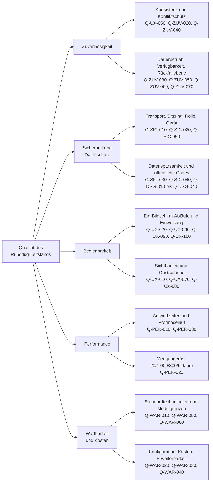

# 10. Qualitätsanforderungen

## 10.1 Qualitätsbaum

## 10.2 Qualitätsszenarien

| ID | Szenario | Erwartete Reaktion | Nachweis |
| --- | --- | --- | --- |
| QS-01 | Zwei Kassen verkaufen im selben Moment die letzten Plätze eines Produkts | Ein Verkauf wird bestätigt, der zweite mit Kapazitäts- oder Versionskonflikt abgewiesen; kein Teilzustand | `scripts/verify_sale_guards.mjs`, `scripts/verify_ticket_assignment_concurrency.mjs` |
| QS-02 | Ein Tablet sendet dasselbe Kommando durch Doppel-Tipp zweimal | Zweite Antwort ist der gespeicherte Beleg mit `duplicate: true`; keine zweite Wirkung | `docs/verification/command-pipeline-v1.md` |
| QS-03 | Ein Gerät war 60 Sekunden offline und sendet auf altem Stand | `STALE_VERSION`; Bediener erhält den aktuellen Stand und entscheidet neu | `packages/domain/src/index.test.ts`, `docs/verification/offline-reconnect.md` |
| QS-04 | Mobilfunkverbindung bricht mitten im Betrieb ab | Letzter bestätigter Stand bleibt mit Alter sichtbar, Schreibaktionen gesperrt, automatische Wiederverbindung mit vollständigem Abgleich | `docs/verification/offline-reconnect.md`, `docs/verification/outage-recovery-foundation.md` |
| QS-05 | Totalausfall über längere Zeit; Betrieb läuft auf Papier weiter | Nacherfassung im Vier-Augen-Prinzip; Dubletten, Zeitfehler und ungültige Übergänge blockieren den Batch | `scripts/verify_outage_recovery.mjs`, `docs/operations/paper-fallback.md` |
| QS-06 | Angreifer probiert automatisiert Ticketcodes durch | Neutrale Antwort für unbekannte und ungültige Codes; ab 30 Fehlversuchen je 60 Sekunden HTTP 429 | `apps/worker/src/public-access.test.ts`, `docs/verification/transport-security-v1.md` |
| QS-07 | Veranstaltungstag mit 1.000 Tickets und 300 Umläufen | Vollständige Prognoseneuberechnung in höchstens zwei Sekunden; keine spürbare Verschlechterung der Oberfläche | `scripts/verify_scale_performance.mjs`, `docs/verification/scale-performance-v1.md` |
| QS-08 | Zwölf Stunden Dauerbetrieb mit 20 verbundenen Geräten | Kein Neustart erforderlich, keine wachsende Speicherlast, stabile Realtime-Verteilung | `scripts/verify_soak_reliability.mjs`, `docs/verification/soak-reliability-v1.md` |
| QS-09 | Betreiber ändert No-Show-Frist und Boardingzeit am Veranstaltungstag | Änderung wirkt sofort über die normale Kommandopipeline, auditiert, ohne Deployment | `docs/architecture/maintainability-and-extension-v1.md`, `scripts/verify_master_data.mjs` |
| QS-10 | Neue Entwicklerin soll eine Fachregel ändern | Regel liegt ausschließlich in `packages/domain` ohne Plattformabhängigkeit; Guardrails verhindern Regelduplikate im Transportcode | `apps/worker/src/maintainability-coverage.test.ts`, `npm run refactor:guardrails` |
| QS-11 | Datenschutzprüfung fragt nach gespeicherten Personendaten | Inventar weist Kategorien, Löschfristen und Speicherorte nach; keine Gastnamen, Push-Daten getrennt und fristgebunden | `docs/operations/privacy-data-inventory-v1.md` |
| QS-12 | Betreiber prüft die monatlichen Kosten | Serverloses Modell mit Hibernation, indexierten Abfragen und R2-Aufbewahrung bleibt im 15-Euro-Rahmen | `docs/operations/cost-controls.md`, `docs/verification/operating-cost-v1.md` |
| QS-13 | Wiederherstellung nach Datenverlust | Restore aus portabler R2-Sicherung beziehungsweise D1 Time Travel in eine isolierte Datenbank innerhalb von 30 Minuten; Format 1 und das streamingfähige Format 2 liefern identische Tabellenmengen und gültige Fremdschlüssel | `apps/worker/src/backup.test.ts`, `scripts/verify_backup_restore.py`, `docs/operations/backup-restore.md` |
| QS-14 | Monitor läuft acht Stunden ohne Bedienung | FIDS-Seite bleibt gebunden und layoutstabil; keine operativen Rechte des Display-Kontos | `docs/verification/public-monitors-v1.md`, `docs/ui/fids-split-layout-stability.md` |
| QS-15 | Helferin bedient die Kasse nach zehn Minuten Einweisung | Ein-Bildschirm-Ablauf ohne Menünavigation; Rollenleitfaden und Screenshots als Einweisungsgrundlage | `docs/roles/kasse.md`, `npm run test:browser:roles` |
| QS-16 | Eine neue Produktionsdatei wird noch von keinem Test importiert | Datei erscheint mit 0 Prozent im LCOV-Nenner; `npm run test:coverage` verhindert eine Unterschreitung der abgerundeten Bestands-Ratchets | `vitest.config.ts`, `docs/verification/coverage-ratchet-2026-08-11.md` |
| QS-17 | Ein Pull Request beschädigt Worker-Laufzeit, D1-Kernablauf, Restore oder Dokumentation | Getrennte parallele CI-Jobs weisen die betroffene Qualitätsgrenze aus; Sonar übernimmt erst nach bestandenem Basisjob dessen LCOV-Bericht und wartet auf das Quality Gate | `.github/workflows/ci.yml`, `docs/verification/ci-quality-gates-2026-08-11.md` |
| QS-18 | Operations-Board mit 300 Umläufen und 1.200 synthetischen Tickets sowie Stammdaten-Template mit 200 Flugzeugen | Die 14 Operations-Kernabfragen laufen in einem D1-Batch, die Registrierungsprüfung in einer Abfrage und die reine Boardprojektion bleibt unter 500 ms | `apps/worker/src/operations-read-service.test.ts`, `apps/worker/src/operations-routes.test.ts`, `apps/worker/src/admin-master-data-template.test.ts`, `docs/verification/operations-read-performance-2026-08-11.md` |
| QS-19 | Ein neuer operativer Commandtyp wird dem Contract hinzugefügt | Die Typprüfung verlangt vor Integration eine eindeutige Familien- und Handlerzuordnung; gemeinsame Rollen-, Idempotenz- und Versionsprüfungen bleiben vor dem Dispatch | `apps/worker/src/command-handler-registry.test.ts`, `docs/verification/command-handler-registry-2026-08-11.md`, `npm run typecheck` |
| QS-20 | Eine interne Refaktorierung verändert Implementierungsnamen, Query-Formulierungen oder JSX-/CSS-Struktur ohne fachliche Änderung | Tests bleiben stabil, weil sie Zustände, Datenbankregeln, HTTP-/Runtime-Grenzen, zugängliche Interaktion und sichtbare Ergebnisse prüfen; produktive `.ts`-/`.tsx`-Quelltexte werden in Tests weder roh importiert noch über das Dateisystem gelesen; Coverage- und Mutation-Ratchets verhindern unbemerkte Lücken | `npm run refactor:guardrails`, `npm run test:coverage`, `npm run test:mutation`, `docs/verification/behavioral-test-quality-2026-08-15.md` |

## 10.3 Nicht abgedeckte oder eingeschränkte Ziele

- **Q-DSG-040 (EU-Verarbeitung)** ist technisch umgesetzt, aber erst nach der rechtlichen Bewertung
  von OQ-06 formal abgenommen; Infrastruktur-Metadaten sind Teil dieser Bewertung.
- **Q-ZUV-060 (99,5 Prozent)** stützt sich auf die Plattformzusagen und die Messungen aus
  `docs/verification/cloudflare-availability-v1.md`; sie ist kein eigenes Redundanzkonzept des
  Vereins.
- **Produktionsfreigabe** steht aus; die Abnahmeumgebung erfüllt T-070 ausdrücklich nicht
  (siehe ADR-0007).
