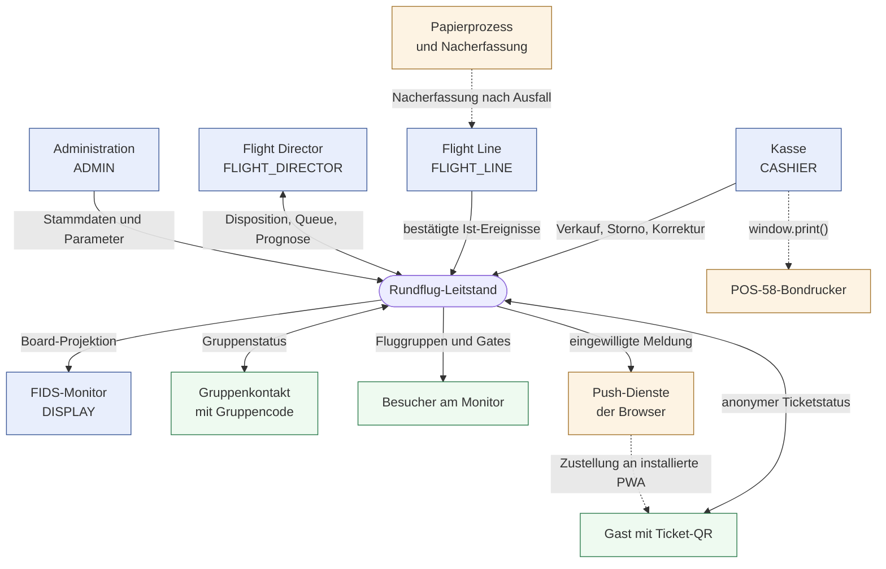
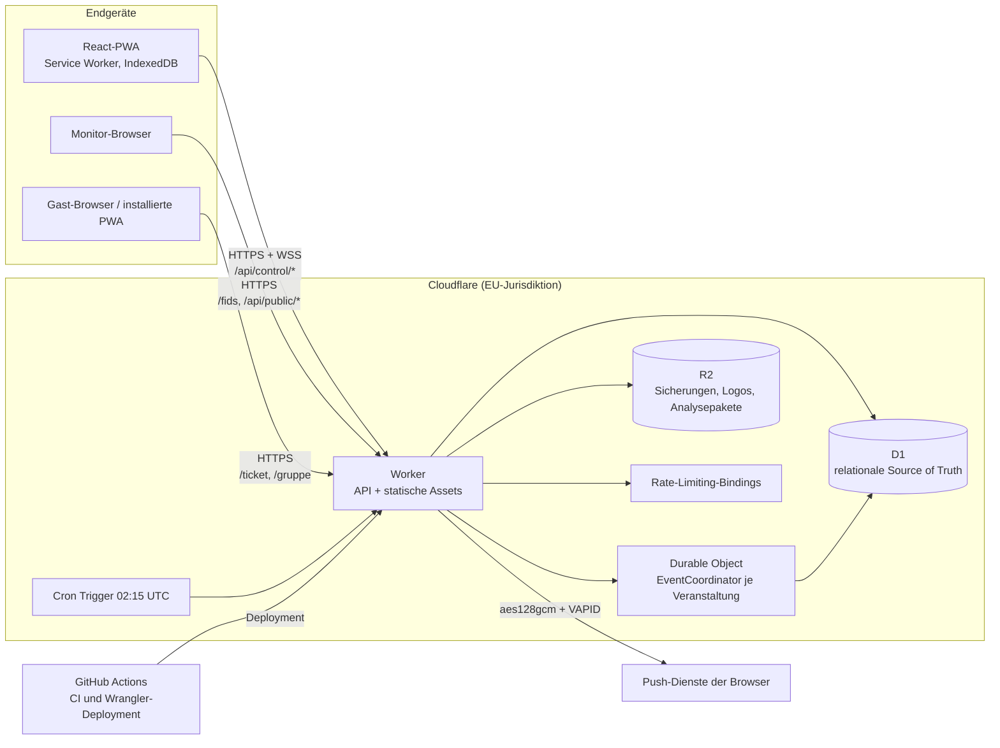

# 3. Kontextabgrenzung

## 3.1 Fachlicher Kontext

Blau: angemeldete operative Rollen. Grün: öffentliche Nutzung ohne Anmeldung. Orange: Umsysteme und
Rückfallebene. Gestrichelte Kanten laufen außerhalb der Anwendung.

| Nachbar | Fachliche Ein-/Ausgabe |
| --- | --- |
| Kasse | Verkauf ganzer Buchungsgruppen, Storno, Korrektur, Zurückstellung, Klärungsfälle, Ticketdruck mit QR-Code |
| Flight Line | bestätigte Ist-Ereignisse eines Umlaufs, Anwesenheit, Gruppennachruf, No-Show |
| Flight Director | Dispatch-Empfehlungen und -Bestätigungen, Flotten- und Pilotenzustände, weicher Betriebsplan, Unterbrechung und Notfallmodus |
| Administration | Veranstaltungen, Produkte, Ressourcengruppen, Gates, Flugzeuge, Piloten, Parameter, Konten, Vorlagen, Berichte, Werksreset |
| FIDS-Monitor | gebundene Board-Projektion je Veranstaltung und Seite, keine Schreibfunktion |
| Gast | anonymer Ticket-/Gruppenstatus, optionale Push-Einwilligung, keine Anmeldung und keine Namensangabe |
| Push-Dienste | verschlüsselte Zustellung an einen browserseitig erzeugten Endpunkt; keine Rückmeldung fachlicher Daten |
| Bondrucker | lokaler Ausdruck über den Standard-Druckdialog des Browsers; keine Treiberintegration im System |
| Papierprozess | dokumentierter Ausfallbetrieb mit anschließender geprüfter Nacherfassung |

## 3.2 Technischer Kontext

| Schnittstelle | Protokoll / Technik | Zweck |
| --- | --- | --- |
| `/api/control/:eventId/commands` | HTTPS POST, typisierte Kommando-Umschläge | einziger Schreibpfad für operative Änderungen |
| `/api/control/:eventId/operations`, `/snapshot` | HTTPS GET | bestätigter materialisierter Zustand für angemeldete operative Clients |
| `/api/control/:eventId/live` | WebSocket (Hibernation) | Signal „neue bestätigte Veranstaltungsversion“ ohne Nutzdaten |
| `/api/public/tickets/:ticketCode`, `/api/public/groups/:groupCode` | HTTPS GET, Hash-Lookup, Rate Limit 30/60 s | anonymer Gast- und Gruppenstatus |
| `/api/public/events/:eventId/board`, `/live`, `/logo` | HTTPS GET, WebSocket | öffentliche Monitorprojektion und Veranstaltungslogo |
| `/api/auth/*`, `/api/setup*`, `/api/admin/*` | HTTPS, Secure-/HttpOnly-Sitzungscookies | Anmeldung, Ersteinrichtung, Konten- und Sicherheitsverwaltung |
| `/api/.../reports/daily.csv`, `daily.pdf`, `exports/*` | HTTPS GET | Tagesberichte, CSV-/JSON-Exporte, Simulationsgrundlage |
| Statische Assets | Cloudflare Assets-Binding, SPA-Fallback | Auslieferung der PWA; `/api/*` und Rollenpfade laufen zuerst durch den Worker |
| Web Push | HTTPS an den browserseitigen Endpunkt, `aes128gcm`, VAPID (RFC 8188/8291/8292) | eingewilligte Statusmeldungen; Löschung nach `PUSH_RETENTION_DAYS` |
| D1-Bindung `DB` | Cloudflare-Bindung, SQL-Batches | Zustand, Ereignisprotokoll, Idempotenzbelege, Outbox |
| Durable-Object-Bindung `EVENT_COORDINATOR` | Cloudflare-Bindung, SQLite-DO | Serialisierung der Kommandos, Realtime-Verteilung, Prognosetakt |
| R2-Bindung `BACKUPS` (EU) | Cloudflare-Bindung | portable Sicherungen, Veranstaltungslogos und Analysearchive |
| Cron `15 2 * * *` | Cloudflare Cron Trigger | Sicherung, Push-Löschfrist, Analysearchive |
| Deployment | GitHub Actions + Wrangler; automatisch nach grünem `main`, manuell wiederanlaufbar | commitgebundener Preflight, Backup, freigegebene Migrationen und Revisionsprüfung ohne Ressourcenanlage |
