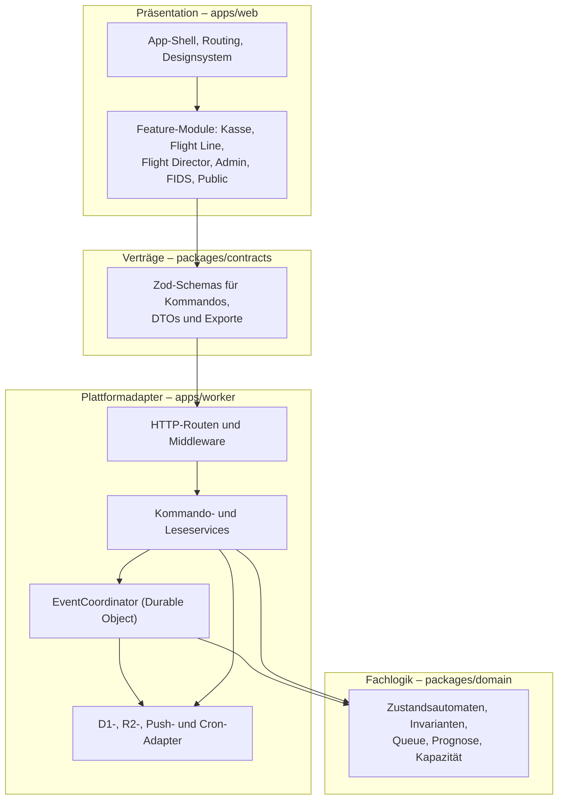

# 4. Lösungsstrategie

## 4.1 Leitentscheidungen im Überblick

| Qualitätsziel | Architekturansatz | Nachweis |
| --- | --- | --- |
| Konsistenz unter paralleler Bedienung | genau ein Durable Object je Veranstaltung serialisiert alle Schreibkommandos; jedes Kommando trägt `commandId` und `expectedVersion`; Zustand, Auditereignis, Idempotenzbeleg und Outbox werden in derselben D1-Batchgrenze geschrieben | ADR-0002, `scripts/verify_vertical_slice.mjs`, `scripts/verify_ticket_assignment_concurrency.mjs` |
| Keine stillen Überschreibungen | optimistische Nebenläufigkeit: abweichende Version liefert `STALE_VERSION`; abgelehnte Kommandos verändern nichts | `packages/domain/src/index.test.ts`, `docs/verification/command-pipeline-v1.md` |
| Betriebsfähigkeit bei schlechter Verbindung | hibernierende WebSockets als Signal, vollständiger Snapshot nach Reconnect, 15-Sekunden-Polling als Fallback, letzter bestätigter Snapshot in IndexedDB, gesperrte Schreibaktionen statt scheinbarem Erfolg | ADR-0005, `docs/verification/offline-reconnect.md` |
| Datensparsamkeit | keine Gastnamen, öffentliche Codes nur als SHA-256-Hash, reduzierte öffentliche DTOs, getrennte Push-Tabellen, Rate Limits | ADR-0006, `apps/worker/src/privacy-schema-coverage.test.ts` |
| Wartbarkeit ohne Herstellerbindung | plattformfreie Fachlogik in `packages/domain`, portable Verträge in `packages/contracts`, Cloudflare ausschließlich in `apps/worker` | ADR-0001, `apps/worker/src/maintainability-coverage.test.ts` |
| Konfigurierbarkeit ohne Deployment | Betriebsparameter, Texte, Schwellenwerte und Zeitmodelle sind Stammdaten und werden über dieselbe Kommandopipeline geändert | Kapitel 8.11 und die ausführbaren Nachweise aus Kapitel 10 |
| Niedrige Betriebskosten | serverloses Ausführungsmodell, Hibernation statt Dauerverbindungen, indexierte D1-Abfragen, R2-Aufbewahrungsregeln | ADR-0008, `docs/operations/cost-controls.md`, `docs/verification/operating-cost-v1.md` |
| Nachvollziehbarkeit | append-only `operational_events` mit D1-Triggern gegen `UPDATE`/`DELETE`, unveränderliche Prognose-Snapshots, portable Sicherungen | `apps/worker/src/audit-coverage.test.ts`, ADR-0004 |

## 4.2 Zerlegung des Systems

Die Abhängigkeitsrichtung ist verbindlich: Oberfläche und Worker hängen von Verträgen und Fachlogik
ab, niemals umgekehrt. `packages/domain` besitzt keine Laufzeitabhängigkeit und importiert weder
Cloudflare-Typen noch HTTP, Datenbank oder React. Ein Betreiberwechsel erfordert damit neue Adapter,
aber keine Neuimplementierung der Fachregeln.

## 4.3 Durchgängige Entwurfsmuster

- **Kommando statt CRUD:** jede operative Änderung ist ein benanntes, typisiertes Kommando mit Rolle,
  Idempotenzschlüssel und erwarteter Version. Es gibt keinen zweiten Schreibpfad.
- **Ereignisprotokoll neben Projektion:** `operational_events` ist die unveränderliche Wahrheit über
  den Verlauf; die relationalen Tabellen sind die materialisierte Sicht darauf.
- **Signal statt Datenverteilung:** der WebSocket überträgt nur „es existiert eine neue bestätigte
  Version“. Jeder Client lädt anschließend genau den DTO, für den er berechtigt ist.
- **Trennung der Zeitarten:** Planzeit, Prognosezeit und Ist-Zeit werden getrennt gespeichert; nur
  bestätigte Ereignisse erzeugen Ist-Zeiten.
- **Mensch bestätigt, System schlägt vor:** Voraufruf, Dispatch-Empfehlungen und weiche Betriebspläne
  sind Vorschläge. Ein Zustandswechsel entsteht ausschließlich durch bestätigte Bedienung.
- **Anonymität als Schemaeigenschaft:** was nicht erhoben wird, kann nicht auslaufen. Öffentliche
  Codes existieren im Kernsystem nur als Hash.
- **Ausführbare Dokumentation:** Architekturaussagen werden durch Guardrail-Skripte, Coverage-Tests
  und Integrationsläufe geprüft, damit die Dokumentation nicht von der Implementierung abdriftet.

## 4.4 Bewusst nicht gewählte Alternativen

| Alternative | Grund der Ablehnung |
| --- | --- |
| Klassischer Application-Server mit eigener Datenbank (VPS) | dauerhafte Betriebs-, Patch- und Kostenlast für einen Verein; Verfügbarkeitsziel am Veranstaltungstag schwerer erreichbar (`docs/operations/provider-comparison.md`) |
| Vollständiges Event Sourcing mit Projektionsneuaufbau zur Laufzeit | Betriebs- und Fehlersuchaufwand übersteigt den Nutzen; gewählt wurde ein append-only Ledger neben einer relationalen Projektion |
| Optimistische Offline-Schreibkommandos mit späterer Zusammenführung | Gruppen- und Umlaufinvarianten sind nicht automatisch auflösbar; operative Kommandos benötigen Serverbestätigung (OQ-01, ADR-0005) |
| Datenverteilung über den WebSocket | Berechtigungsprüfung müsste im Verteilpfad wiederholt werden; ein reines Versionssignal ist kleiner, sicherer und kostengünstiger |
| Genaue öffentliche Startzeiten | erzeugt scheinbare Zusagen und Beschwerden; öffentlich sind Zeitfenster, Wartepositionen und Handlungsaufforderungen |
| Mehrere parallele Cloudflare-Umgebungen | Kosten und Verwechslungsgefahr; genau eine Abnahmeumgebung mit klarem Produktions-Gate (ADR-0007) |
