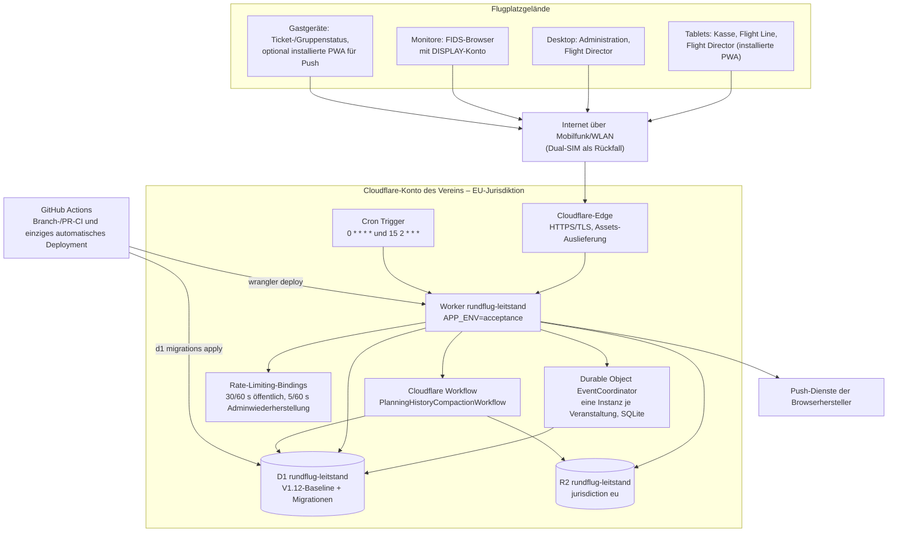
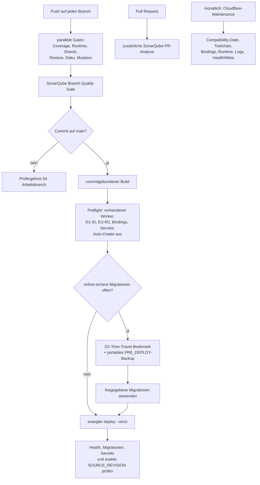

# 7. Verteilungssicht

## 7.1 Infrastruktur der Abnahmeumgebung

| Knoten | Ausführungsumgebung | Bemerkung |
| --- | --- | --- |
| Endgeräte | moderne Browser, installierbare PWA je Rolle (eigene Web-App-Manifeste und Icons) | Offline-Snapshot in IndexedDB; iOS-Web-Push erfordert die installierte PWA |
| Worker | V8-Isolate am Cloudflare-Edge, `compatibility_date` 2026-08-15, `nodejs_compat` | liefert zusätzlich die statischen Assets aus; `/api/*` und Rollenpfade laufen zuerst durch den Worker; persistierte Logs und niedrig gesampelte Traces sind aktiviert |
| Durable Object | SQLite-basiert, außerhalb der Entwicklung mit `jurisdiction("eu")` angefordert | genau eine aktive Instanz je Veranstaltung; hibernierende WebSockets |
| D1 | Cloudflare-verwaltetes SQLite, Bindung `DB` | Source of Truth; Time Travel als kurzfristiger Wiederherstellungspfad |
| R2 | Bucket mit `jurisdiction: eu`, Bindung `BACKUPS` | portable ZIP-/NDJSON-Sicherungen als Multipart-Archiv plus SHA-256-Sidecar, Veranstaltungslogos und Analysepakete; keine öffentlichen Bucket-URLs |
| Cron | Cloudflare Cron Trigger | täglicher Wartungslauf, siehe Kapitel 6.6 |
| Workflow | Cloudflare Workflows, Bindung `PLANNING_HISTORY_COMPACTION` | eine langlebige, wiederaufnehmbare Kompaktion je Planungshistoriensegment |

## 7.2 Umgebungen

| Umgebung | Zweck | Besonderheiten |
| --- | --- | --- |
| Lokale Entwicklung | `npm run dev` | Vite auf `http://localhost:5173`, Wrangler/Miniflare auf `http://localhost:8787`; Vite leitet `/api` und WebSockets weiter; lokale D1 mit synthetischen Seed-Daten; `APP_ENV=development` verzichtet auf die EU-Jurisdiktionsanforderung, weil workerd sie lokal nicht abbildet |
| Prognosesimulator | `npm run simulator` | reine Browserausführung unter `/simulation` und eigenständiges FIDS unter `/simulation/fids`, ohne Worker, D1 oder Anmeldung; beide Tabs synchronisieren flüchtigen Zustand über einen gleichursprünglichen `BroadcastChannel`; im Cloudflare-Build zusätzlich lazy hinter Anmeldung und Rolle `ADMIN` |
| Abnahme (aktuell) | Cloudflare, `APP_ENV=acceptance` | einzige betriebene Cloudflare-Umgebung; `/api/meta` meldet `productionReady: false` |
| Produktion (Gate) | erst nach vollständiger V1-Abnahme | verbindlich getrennte D1-Datenbank, separater EU-R2-Bucket und getrennte Secret-Sätze (ADR-0007) |

## 7.3 Konfiguration und Geheimnisse

| Art | Schlüssel | Wirkung |
| --- | --- | --- |
| Variable | `APP_ENV` | `development`, `acceptance` oder Produktionswert; steuert HTTPS-Erzwingung und Jurisdiktionsanforderung |
| Variable | `DATA_JURISDICTION` | dokumentiert und meldet die EU-Verarbeitung über `/api/meta` |
| Variable | `PUSH_RETENTION_DAYS` (7) | Löschfrist für Push-Abonnements nach Veranstaltungsende |
| Variable | `ANALYSIS_RETENTION_DAYS` (30) | Ablauf der Tagesanalysepakete in R2 |
| Variable | `PLANNING_DETAIL_RETENTION_HOURS` (24) | heißes Detailfenster; zulässig 24 bis 168 Stunden, in Produktion explizit |
| Variable | `PLANNING_HISTORY_RETENTION_YEARS` (5) | kalte Planungshistorie; zulässig fünf bis zehn Kalenderjahre, in Produktion explizit |
| Variable | `SOURCE_REVISION` | im Deployment gesetzter Commit; Grundlage für Replay-Vergleiche |
| Secret | `ADMIN_PIN_HASH` | langsamer, gesalzener Hash der Administrator-PIN |
| Secret | `BOOTSTRAP_TOKEN` | einmalige Ersteinrichtung; niemals in Rollenunterlagen oder Logs |
| Secret | `DEPLOYMENT_BACKUP_TOKEN_HASH` | ausschließlich SHA-256-Hash des GitHub-Environment-Tokens für den internen Pre-Deployment-Backup-Endpunkt |
| Secret | `VAPID_PUBLIC_KEY`, `VAPID_PRIVATE_KEY`, `VAPID_SUBJECT` | Web-Push-Authentifizierung; der private Schlüssel verlässt Cloudflare Secrets nicht |

Secrets werden ausschließlich über Cloudflare Secrets beziehungsweise `.dev.vars` gesetzt.
`scripts/check_no_secrets.sh` und die Definition of Done verhindern, dass Geheimnisse in Diffs, Logs
oder Testfixtures auftauchen.

## 7.4 Bereitstellung

GitHub Actions ist die einzige automatische Deployment-Autorität. Jeder Branch wird unabhängig von
einem Pull Request geprüft. `main` wird erst nach allen Gates automatisch ausgerollt; der manuelle
Workflow bleibt als Wiederanlauf mit Bestätigung `DEPLOY` verfügbar. Native automatische
Cloudflare-Git-Builds sind nach erfolgreicher Inbetriebnahme dieses Pfads deaktiviert.

Der Preflight legt niemals Ressourcen an. Er verlangt den vorhandenen Worker, die exakte D1-ID und
den vorhandenen EU-R2-Bucket. Nur unveränderte, per SHA-256 geprüfte und ausdrücklich online-sichere
Folgemigrationen werden nach D1-Bookmark und portablem Backup automatisch angewendet. Der einmalige
inkompatible Neustart auf `0001_v1_12_baseline.sql` bleibt ausschließlich dem vollständigen Neuaufbau
aus ADR-0045 vorbehalten. Details: ADR-0057 und `docs/operations/ci-cd-stabilitaet.md`.
