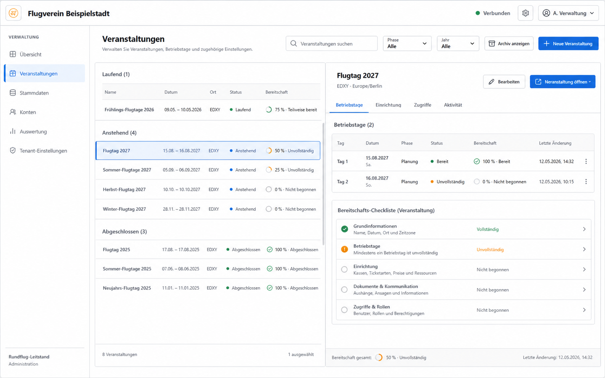
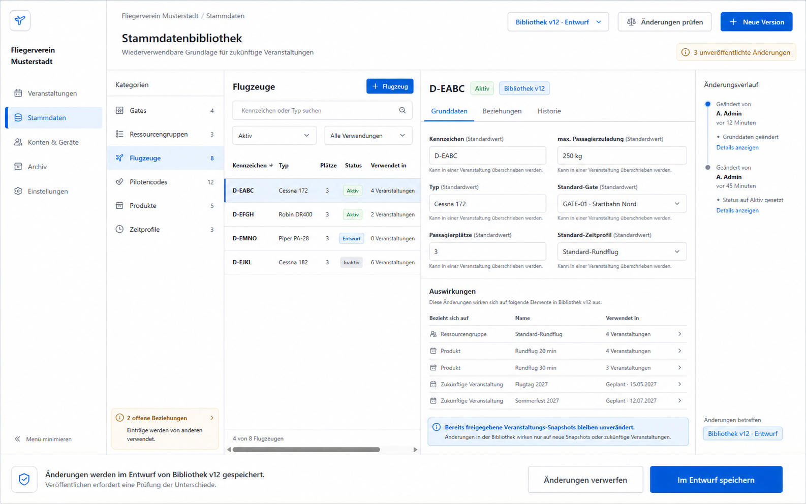
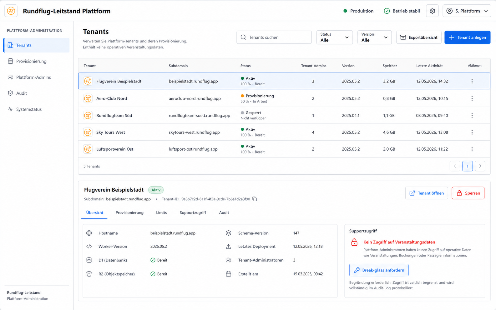
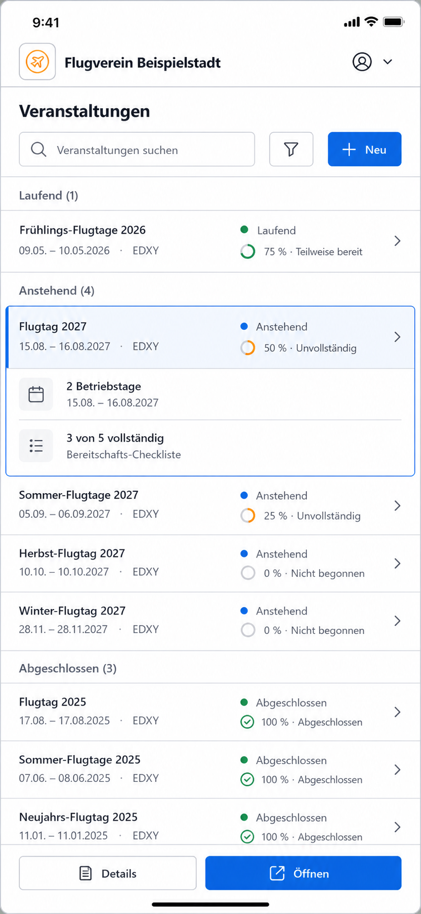

# Zukunftsplan: Multi-Tenant- und Multi-Veranstaltungsplattform

- Status: Diskussions- und Planungsstand, nicht zur Umsetzung freigegeben
- Stand: 16.08.2026
- Planungshorizont: nach V1.12.0, vor einer produktiven SaaS-Migration
- Adressaten: Produktverantwortung, Architektur, UX/UI, Entwicklung und Betrieb

## 1. Zweck und Verbindlichkeit

Dieses Dokument beschreibt einen möglichen Ausbau des Rundflug-Leitstands zu einer
Multi-Tenant- und Multi-Veranstaltungsplattform. Es bündelt Produktentscheidungen,
Architekturideen, Cloudflare-Routing, Sicherheits- und Datenisolation, Administration,
Stammdatenpflege, UX/UI, Migration, Arbeitspakete und offene Entscheidungsfragen.

Der Plan ist bewusst breiter als die heute freigegebenen Requirements und ADRs. Er ändert den
aktuellen Systemstand nicht und ist keine Umsetzungsfreigabe. Vor einer Umsetzung müssen die
betroffenen Anforderungen fortgeschrieben, strukturprägende Entscheidungen als ADRs beschlossen,
das Bedrohungsmodell geprüft und die arc42-Dokumentation aktualisiert werden.

Die Konzeptbilder sind explorative Referenzen für Informationsarchitektur, Dichte und visuelle
Hierarchie. Die Texte in diesem Dokument sind bei Abweichungen maßgeblich. Insbesondere sind
Bildtexte keine neuen fachlichen Anforderungen.

## 2. Ausgangslage

Die heutige Anwendung ist bereits mehrveranstaltungsfähig, behandelt Veranstaltungen jedoch
weitgehend als obersten Mandantenkontext:

- D1 ist eine gemeinsame relationale Source of Truth.
- Ein SQLite-Durable-Object je Veranstaltung serialisiert Kommandos und verteilt Realtime-Updates.
- Die Administration enthält sowohl den Veranstaltungskatalog als auch die veranstaltungsbezogene
  Einrichtung von Gates, Ressourcengruppen, Flugzeugen, Pilotencodes und Produkten.
- Operator-Konten, Sitzungen und Login-Codes sind global angelegt.
- Die Routen und API-Verträge erwarten einen expliziten Veranstaltungskontext.
- R2 wird gemeinsam für Sicherungen, Logos und Analysepakete verwendet.

Für organisatorisch unabhängige Kunden fehlen damit eine explizite Tenant-Grenze, tenantgebundene
Identitäten und Sitzungen, isolierte Datenbanken und Speicherbereiche, ein Plattform-Control-Plane
sowie eine klare Trennung zwischen wiederverwendbaren Stammdaten und eingefrorener
Veranstaltungskonfiguration.

## 3. Leitentscheidungen dieses Plans

| Thema | Planungsannahme |
| --- | --- |
| Zielgröße | ungefähr 10 bis 500 Tenants |
| Hierarchie | Plattform → Tenant → Veranstaltung → Veranstaltungstag |
| Datenisolation | eigene D1-Datenbank je Tenant |
| Laufzeit | Cloudflare Workers for Platforms mit Tenant-Dispatch |
| Tenant-Routing | produktiv primär per Subdomain |
| Übergang auf workers.dev | pfadbasierter Tenant-Kontext |
| Plattformverwaltung | eigener Control Plane und eigene Plattform-Administration |
| Stammdaten | versionierte Tenant-Bibliothek |
| Veranstaltungsdaten | unveränderlicher Bibliotheks-Snapshot plus kontrollierte Event-Overrides |
| Plattformrollen | persönliche Identitäten mit MFA beziehungsweise externem IdP |
| Operative Rollen | weiterhin anonyme Codes mit PIN, tenant- und eventgebunden |
| Super-Admin | Control-Plane-Rolle; kein stiller Zugriff auf Tenant-Fachdaten |
| Bestandsmigration | heutige Installation wird zum ersten Root-Tenant |
| Custom Domains | architektonisch vorbereitet, nicht Teil der ersten Ausbaustufe |
| Billing | ausdrücklich nicht Teil des ersten Plattformumfangs |

Diese Festlegungen sind Vorschläge. Die Entscheidungstore in Abschnitt 29 müssen vor einer
Implementierung geschlossen werden.

## 4. Begriffe und fachliche Hierarchie

- **Plattform:** technische Gesamtinstallation und Control Plane.
- **Tenant:** organisatorisch und datenschutzrechtlich eigenständiger Betreiber, zum Beispiel ein
  Verein oder Veranstalter.
- **Veranstaltung:** fachlicher Rahmen wie Flugtag 2027, der mehrere Tage umfassen kann.
- **Veranstaltungstag:** operativer Tag mit eigenem Status, Zeitmodell, Queue, Tickets, Umläufen,
  Forecast, Audit und Realtime-Koordination.
- **Stammdatenbibliothek:** wiederverwendbare Tenant-Vorlagen für Gates, Ressourcengruppen,
  Flugzeuge, Pilotencodes, Produkte und Zeitprofile.
- **Bibliotheksversion:** veröffentlichter, revisionssicherer Stand der Tenant-Stammdaten.
- **Veranstaltungs-Snapshot:** zur Veranstaltung kopierter und danach von der Bibliothek
  entkoppelter Stand.
- **Control Plane:** Plattformdaten und Plattformfunktionen für Provisionierung, Domains,
  Tenantstatus, Plattformrollen, Rollout und Audit.
- **Tenant Plane:** fachliche Laufzeit eines einzelnen Tenants mit eigener D1-Datenbank und
  logisch getrenntem Objektspeicher.

~~~mermaid
flowchart TD
  P["Plattform"]
  T["Tenant"]
  L["Versionierte Stammdatenbibliothek"]
  E["Veranstaltung"]
  S["Veranstaltungs-Snapshot"]
  D1["Veranstaltungstag 1"]
  D2["Veranstaltungstag n"]
  O["Queues, Tickets, Umläufe, Forecast, Audit"]
  A["Tenant-Konten und Event-Zuordnungen"]

  P --> T
  T --> L
  T --> E
  T --> A
  L -->|"Snapshot beim Anlegen"| S
  E --> S
  E --> D1
  E --> D2
  D1 --> O
  D2 --> O
~~~

## 5. Zielarchitektur

### 5.1 Gesamtbild

~~~mermaid
flowchart LR
  B["Browser oder PWA"]
  ER["Edge Router"]
  PD["Workers-for-Platforms-Dispatch"]
  TW["Tenant Worker"]
  TD1[("Tenant D1")]
  TR2[("Tenant-R2-Präfix oder Bucket")]
  TC["Tenant Coordinator"]
  DC["Day Coordinator"]

  PA["Plattform-Administration"]
  CP["Control-Plane Worker"]
  CD1[("Control D1")]
  PR2[("Plattform-R2")]
  PJ["Provisionierungs- und Rollout-Jobs"]

  B -->|"tenant-a.rundflug.app"| ER
  ER --> PD
  PD --> TW
  TW --> TD1
  TW --> TR2
  TW --> TC
  TW --> DC

  PA -->|"platform.rundflug.app"| CP
  CP --> CD1
  CP --> PR2
  CP --> PJ
  CP -. "liefert ausschließlich Runtime-Zuordnung" .-> PD
~~~

### 5.2 Control Plane

Der Control Plane kennt Tenants und technische Zuordnungen, aber keine normalen Tickets, Queues,
Umläufe oder operativen Eventdaten. Er verantwortet:

- Tenant-Lebenszyklus und Status,
- bestätigte Domains und Slugs,
- Zuordnung von Tenant-D1, R2-Namespace und Runtime-Version,
- persönliche Plattformidentitäten und Plattformrollen,
- initiale Tenant-Administratorzuordnung,
- Provisionierungs-, Migrations- und Rollout-Jobs,
- tenantübergreifende technische Gesundheitsindikatoren,
- Breakglass-Freigaben,
- append-only Plattform-Audit.

Plattformlisten dürfen nur aggregierte, datensparsame Werte anzeigen, zum Beispiel letzte technische
Aktivität, Datenbankgröße, Laufzeitversion und Healthstatus. Fachliche Kennzahlen gehören nicht
automatisch in den Control Plane.

### 5.3 Tenant Plane

Jeder Tenant besitzt:

- eine eigene D1-Datenbank als relationale Source of Truth,
- einen eindeutig getrennten R2-Namespace; ein eigener Bucket ist optional,
- mindestens einen Tenant Coordinator für tenantweite Konflikte,
- einen Day Coordinator je aktivem Veranstaltungstag,
- tenantlokale Operator-Konten, Sitzungen, Stammdaten, Veranstaltungen und Audits.

Die reine Fachlogik bleibt in packages/domain. Tenantauflösung, Cloudflare-Bindings,
Provisionierung und Dispatch bleiben Adapter außerhalb des Domain-Pakets.

### 5.4 Zwei Koordinationsebenen

Der heutige Event-Koordinator wird fachlich auf den Veranstaltungstag präzisiert:

- **Day Coordinator:** serialisiert Tageskommandos, hält WebSockets und schützt Queue-, Ticket-,
  Umlauf- und Forecastzustände.
- **Tenant Coordinator:** schützt seltene tenantweite Invarianten, etwa zeitgleiche Verwendung
  derselben physischen Ressource über zwei aktive Veranstaltungstage oder die Veröffentlichung einer
  Stammdatenversion.

Der Tenant Coordinator darf nicht zum globalen Flaschenhals aller operativen Kommandos werden.

### 5.5 Cloudflare-Eignung und technischer Spike

Cloudflare beschreibt D1 ausdrücklich als für horizontale Skalierung mit Datenbanken pro Kunde
geeignet. Gleichzeitig ist eine einzelne D1-Datenbank seriell und besitzt Plattformgrenzen für
Datenbankzahl, Größe und Worker-Bindings. Workers for Platforms kann Requests über einen Dispatch
Worker an kundenspezifische beziehungsweise tenantgebundene Worker weiterreichen.

Vor einer Architekturfreigabe ist ein technischer Spike erforderlich, der mindestens prüft:

- dynamische D1- und R2-Zuordnung pro Tenant,
- Dispatch-Latenz und Fehlerbilder,
- Versionierung und Rollback des Tenant Workers,
- Limits und Kosten für die erwartete Tenantzahl,
- lokale Entwicklung, Preview und Integrationstests,
- Verhalten von Cron, Queues, Durable Objects und Service Bindings im Dispatch-Modell.

Quellen:

- [D1 Limits](https://developers.cloudflare.com/d1/platform/limits/)
- [Workers for Platforms – Funktionsweise](https://developers.cloudflare.com/cloudflare-for-platforms/workers-for-platforms/how-workers-for-platforms-works/)
- [Workers for Platforms – Bindings](https://developers.cloudflare.com/cloudflare-for-platforms/workers-for-platforms/configuration/bindings/)

## 6. Routing und Tenantauflösung

### 6.1 Produktionsziel mit Subdomains

Beispielhafte Zielstruktur:

- **verein-a.rundflug.app** – Tenant-Anwendung
- **verein-b.rundflug.app** – anderer Tenant
- **app.rundflug.app** – zentrale Tenant-Suche und Anmeldung
- **platform.rundflug.app** – Plattform-Administration

Cloudflare erhält einen Wildcard-DNS-Eintrag und eine passende Worker-Route für
**\*.rundflug.app/\***. Die Zertifikatsabdeckung muss separat geprüft werden. Universal SSL deckt
bei einer normalen Zone üblicherweise die Zone und Subdomains der ersten Ebene ab; tiefere
Subdomainebenen oder Sonderfälle benötigen eine andere Zertifikatsstrategie.

Ein Cloudflare-Worker-Custom-Domain-Eintrag ist nicht gleichbedeutend mit einer Wildcard-Route.
Für dynamische Tenant-Subdomains ist die Kombination aus DNS-Wildcard und Worker-Route maßgeblich.

Quellen:

- [Wildcard DNS Records](https://developers.cloudflare.com/dns/manage-dns-records/reference/wildcard-dns-records/)
- [Worker Routes](https://developers.cloudflare.com/workers/configuration/routing/routes/)
- [Universal SSL – Einschränkungen](https://developers.cloudflare.com/ssl/edge-certificates/universal-ssl/limitations/)

### 6.2 workers.dev während Entwicklung und Übergang

Die bestehende Adresse **rundflug-leitstand.andreas-7f3.workers.dev** kann nicht wie eine eigene
DNS-Zone beliebige Tenant-Subdomains erhalten. Das workers.dev-Schema ist durch Workername und
Account-Subdomain vorgegeben.

Deshalb verwendet die Übergangsphase:

- **rundflug-leitstand.andreas-7f3.workers.dev/t/verein-a/**
- **rundflug-leitstand.andreas-7f3.workers.dev/t/verein-b/**
- **rundflug-leitstand.andreas-7f3.workers.dev/platform/**

Dieser Pfadmodus unterstützt Funktionsentwicklung, ist aber keine gleichwertige Sicherheitsgrenze:
alle Tenants teilen denselben Origin. Cookies, Local Storage, IndexedDB, Cache Storage,
Service-Worker-Scope und Web-Push-Schlüssel müssen deshalb zusätzlich nach Tenant partitioniert
werden.

Beim Pfadmodus gelten:

- Cookie Path auf **/t/{tenantSlug}** beschränken,
- tenantgebundene Cache-, IndexedDB- und Local-Storage-Schlüssel verwenden,
- Service Worker ausschließlich im Tenant-Pfad registrieren oder Tenant-Caches strikt trennen,
- keine sensitiven Daten tenantübergreifend in Browserzuständen halten,
- serverseitige Autorisierung niemals aus dem Pfad allein ableiten.

Quelle: [workers.dev Routing](https://developers.cloudflare.com/workers/configuration/routing/workers-dev/)

### 6.3 Verbindlicher Resolver

Der Tenant wird serverseitig aus einem validierten Hostnamen beziehungsweise aus einer kontrollierten
Preview-Route aufgelöst. Ein beliebiger Tenant-Header, ein Request-Body-Feld oder eine Clientangabe
darf den Kontext nicht überschreiben.

Resolver-Schritte:

1. Host normalisieren und gegen erlaubte Plattformhosts prüfen.
2. Tenant-Domain beziehungsweise Preview-Slug im Control Plane nachschlagen.
3. nur aktive, bestätigte Zuordnung akzeptieren.
4. tenantgebundene Runtime- und Ressourcenreferenzen laden.
5. unveränderlichen TenantContext an alle Adapter übergeben.
6. Session zusätzlich auf denselben Tenant und Host prüfen.

Unbekannte, gesperrte oder nicht bestätigte Hosts liefern eine neutrale Fehlerseite ohne
Tenantmetadaten.

### 6.4 Zentrale Tenant-Suche

Die zentrale Einstiegsseite bietet:

- direkten Tenant-Link beziehungsweise QR-Code,
- Suche nach freigegebenem Anzeigenamen oder Organisationscode,
- zuletzt verwendete Tenants nur lokal auf dem Gerät,
- Weiterleitung auf den Tenant-Origin vor der Anmeldung.

Die Suche darf keine internen Tenant-IDs, E-Mail-Adressen, Kontostatusdetails oder nicht
veröffentlichten Tenants aufzählbar machen.

## 7. Identitäten, Anmeldung und Berechtigungen

### 7.1 Zwei Authentifizierungsebenen

**Persönliche administrative Identitäten**

- PLATFORM_ADMIN und optional PLATFORM_SUPPORT,
- TENANT_OWNER und TENANT_ADMIN,
- MFA verpflichtend,
- perspektivisch externer OIDC-/SAML-IdP oder verifizierter E-Mail-Login,
- persönliche, widerrufbare Identität,
- vollständiges Audit administrativer Änderungen.

**Anonyme operative Identitäten**

- CASHIER, FLIGHT_LINE, FLIGHT_DIRECTOR und DISPLAY,
- weiterhin Code plus PIN beziehungsweise gerätegebundene Anmeldung,
- tenantlokale Login-Codes,
- explizite Zuweisung zu Veranstaltungen oder Veranstaltungstagen,
- keine Namen, Lizenzen oder Kontaktinformationen im operativen Kern.

### 7.2 Anmeldefluss

~~~mermaid
sequenceDiagram
  participant U as Benutzer
  participant C as Zentrale Suche
  participant T as Tenant-Origin
  participant A as Tenant-Authentifizierung
  participant S as Tenant-Sitzung

  U->>C: Tenant auswählen oder Direktlink öffnen
  C-->>U: Redirect zu tenant-a.rundflug.app
  U->>T: Anmeldeseite öffnen
  T->>A: Hostgebundenen TenantContext verwenden
  U->>A: persönliche Anmeldung oder Code + PIN
  A->>A: Identität, Rolle und Event-Zuordnung prüfen
  A-->>S: tenant- und hostgebundene Sitzung
  S-->>U: Rollenstartseite oder Veranstaltungsauswahl
~~~

### 7.3 Sessionregeln

- Eine Tenant-Sitzung enthält Tenant-ID, Identitäts-ID, Rollen, Eventzuweisungen,
  Authentifizierungsstärke, Ausstellungszeit und Ablauf.
- Die Tenant-ID stammt nicht aus einem frei änderbaren Clientfeld.
- Eine Sitzung von Tenant A ist auf Tenant B ungültig.
- Plattform- und Tenant-Sitzungen verwenden getrennte Cookie-Namen und Audiences.
- Pfadmodus-Sitzungen erhalten einen tenantbezogenen Cookie-Pfad; produktiv werden host-only
  Cookies bevorzugt.
- Rollenwechsel, Tenant-Sperre und Eventzuweisungsänderung widerrufen betroffene Sitzungen.
- CSRF-, SameSite-, Secure- und Originprüfung bleiben verpflichtend.

### 7.4 Rollen

| Rolle | Ebene | Hauptrechte |
| --- | --- | --- |
| PLATFORM_ADMIN | Plattform | Tenant-Lebenszyklus, Domains, Rollout, Breakglass-Freigabe |
| PLATFORM_SUPPORT | Plattform | Health und Diagnostik ohne normalen Fachdatenzugriff |
| TENANT_OWNER | Tenant | Administratoren, Richtlinien, Export und Löschfreigaben |
| TENANT_ADMIN | Tenant | Veranstaltungen, Bibliothek, Konten und Geräte |
| EVENT_ADMIN | Veranstaltung | Vorbereitung und Abschluss zugewiesener Veranstaltungen |
| FLIGHT_DIRECTOR | Veranstaltungstag | operative Koordination |
| FLIGHT_LINE | Veranstaltungstag | Flugzeugbetreuung und Ist-Ereignisse |
| CASHIER | Veranstaltungstag | Verkauf im zugewiesenen Kontext |
| DISPLAY | Veranstaltungstag | monitorbezogene, minimal privilegierte Sitzung |

Ob EVENT_ADMIN als eigene Rolle benötigt wird, bleibt ein Entscheidungstor. Tenant-Rollen und
Eventzuweisungen sind getrennte Konzepte.

### 7.5 Super-Admin und Breakglass

Ein Plattformadministrator kann Tenants verwalten, erhält aber nicht automatisch Zugriff auf deren
Fachdaten. Ein Breakglass-Zugriff benötigt:

- konkreten Tenant und Zweck,
- zeitlich begrenzte Freigabe,
- starke erneute Authentifizierung,
- möglichst Vier-Augen-Freigabe,
- nur benötigte Leserechte; Schreibzugriff separat,
- sichtbaren Hinweis im Tenant,
- append-only Audit im Control Plane und Tenant,
- automatische Beendigung und nachträgliche Überprüfung.

Support darf niemals eine Tenant-Identität stillschweigend imitieren.

## 8. Datenmodell

### 8.1 Control-Datenbank

Vorgesehene Aggregate:

- tenants
- tenant_domains
- tenant_runtime_assignments
- platform_identities
- platform_role_assignments
- tenant_admin_memberships
- provisioning_jobs
- rollout_assignments
- breakglass_grants
- platform_audit_entries
- tenant_health_snapshots

Tenantstatus:

~~~text
REQUESTED → PROVISIONING → ACTIVE
                       ↘ FAILED
ACTIVE → SUSPENDED → ACTIVE
ACTIVE → DECOMMISSIONING → DELETED
~~~

DELETED ist im operativen Modell ein Abschlussstatus. Physische Löschung folgt einer gesonderten
Aufbewahrungs- und Wiederherstellungsrichtlinie.

### 8.2 Tenant-Datenbank

Neue beziehungsweise neu geordnete Aggregate:

- tenant_metadata
- events
- operation_days mit event_id
- library_versions
- library_gates
- library_resource_groups
- library_aircraft
- library_pilot_codes
- library_products
- library_time_profiles
- event_snapshots
- event_snapshot_items
- event_overrides
- operator_accounts
- operator_event_assignments
- operator_sessions
- tenant_audit_entries

Die vorhandenen operativen Tabellen bleiben auf den Veranstaltungstag bezogen. Öffentliche,
persistierte oder bereits ausgerollte Bezeichner werden nicht nur aus Stilgründen umbenannt.
Kompatibilitätsadapter und additive Migrationen sind vorzuziehen.

### 8.3 IDs und Slugs

- stabile, nicht erratbare technische IDs für Referenzen,
- menschenlesbare, änderbare Slugs ausschließlich fürs Routing,
- Slugänderungen mit Redirect- und Sperrfrist,
- globale Eindeutigkeit nur im Control Plane,
- fachliche Kürzel und Login-Codes nur im Tenant beziehungsweise Event eindeutig,
- keine Tenant-ID in öffentlichen Statuscodes oder Ticketnummern offenlegen.

### 8.4 Veranstaltungsstatus

Eine Veranstaltung kann aus Tagesstatus abgeleitet werden:

- DRAFT
- UPCOMING
- RUNNING
- COMPLETED
- ARCHIVED

Ein mehrtägiges Event kann gleichzeitig abgeschlossene, aktive und zukünftige Tage besitzen. Der
Veranstaltungsstatus darf operative Tagesstatus nicht ersetzen.

## 9. Stammdatenbibliothek und Veranstaltungs-Snapshots

### 9.1 Ziel

Stammdaten werden nicht länger implizit in einer Veranstaltung gepflegt und anschließend exportiert.
Jeder Tenant besitzt eine eigenständige, versionierte Bibliothek. Veranstaltungen übernehmen daraus
einen nachvollziehbaren Snapshot.

### 9.2 Lebenszyklus

1. Administrator bearbeitet eine neue Bibliotheksversion im Status DRAFT.
2. Der Änderungsvergleich zeigt Hinzufügungen, Änderungen, Deaktivierungen und Abhängigkeiten.
3. Validierung prüft fachliche Invarianten und referenzielle Vollständigkeit.
4. Veröffentlichung erzeugt eine unveränderliche Version.
5. Eine neue Veranstaltung wählt eine veröffentlichte Version und erzeugt einen Snapshot.
6. Der Snapshot wird eventlokal ergänzt, zum Beispiel durch aktive Ressourcen oder Zeitangaben.
7. Spätere Bibliotheksänderungen verändern den Snapshot nicht automatisch.

### 9.3 Kategorien

| Kategorie | Wiederverwendbare Bibliotheksdaten | Typische Eventergänzung |
| --- | --- | --- |
| Gates | Bezeichnung, Art, Standardfilter | aktiv, eventbezogene Anzeige |
| Ressourcengruppen | Bezeichnung, Standardbeziehungen | aktive Flugzeugzuordnungen, Status |
| Flugzeuge | Kennzeichen, Typ, Kapazität, Standardwerte | aktiv/inaktiv, Eventstatus |
| Pilotencodes | anonymer Code, Status | Freigabe und Tageszuordnung |
| Produkte | Name, Kürzel, Preisinfo, Zeitmodell, Standardgruppe | Verkaufsschluss, Livefreigabe |
| Zeitprofile | Bodenphasen und Standardwerte | eventbezogene Overrides |

Die Bibliothek speichert keine operativen Livezustände, Tickets, Queues oder Umläufe.

### 9.4 Aktualisierung einer geplanten Veranstaltung

Ein geplantes, noch nicht aktives Event kann optional auf eine neuere Bibliotheksversion aktualisiert
werden. Das ist kein stiller Austausch:

1. Quell- und Zielversion wählen.
2. dreiseitigen Vergleich Bibliothek alt, Event-Snapshot, Bibliothek neu anzeigen.
3. Konflikte und Event-Overrides sichtbar machen.
4. Änderungen einzeln oder gruppiert auswählen.
5. serverseitig vollständig validieren.
6. neuen Snapshotstand und Audit atomar speichern.

Nach Beginn des ersten Veranstaltungstags sind automatische oder massenhafte Übernahmen gesperrt.
Notwendige Änderungen erfolgen als explizite Eventänderungen mit denselben Concurrency- und
Auditregeln wie heute.

## 10. Schnittstellen und TenantContext

Jeder geschützte Handler erhält einen serverseitig erzeugten TenantContext. APIs akzeptieren keine
frei wählbare Tenant-ID als Autoritätsquelle.

Beispielhafte Plattformendpunkte:

- POST /api/platform/tenants
- GET /api/platform/tenants
- GET /api/platform/tenants/{tenantId}
- POST /api/platform/tenants/{tenantId}/suspend
- POST /api/platform/tenants/{tenantId}/resume
- POST /api/platform/tenants/{tenantId}/domains
- POST /api/platform/tenants/{tenantId}/breakglass-grants

Beispielhafte Tenantendpunkte:

- GET /api/admin/events
- POST /api/admin/events
- GET /api/admin/library/versions
- POST /api/admin/library/versions
- POST /api/admin/library/versions/{versionId}/publish
- POST /api/admin/events/{eventId}/snapshot
- GET /api/admin/events/{eventId}/snapshot-diff
- GET /api/admin/operator-accounts
- PUT /api/admin/operator-accounts/{accountId}/assignments

Bestehende Endpunkte mit eventId bleiben während der Migration kompatibel. Intern wird klar zwischen
eventId und operationDayId unterschieden.

## 11. Provisionierung und Plattformbetrieb

### 11.1 Provisionierungsablauf

~~~mermaid
sequenceDiagram
  participant P as Plattformadministrator
  participant C as Control Plane
  participant J as Provisionierungsjob
  participant CF as Cloudflare-Ressourcen
  participant T as Tenant

  P->>C: Tenant mit Slug und Erstadmin anlegen
  C->>C: Eindeutigkeit prüfen, Status REQUESTED
  C->>J: idempotenten Job starten
  J->>CF: D1 und R2-Namespace bereitstellen
  J->>CF: Schema migrieren und Runtime zuordnen
  J->>T: Rootdaten und Admin-Einladung erzeugen
  J->>C: Healthcheck und ACTIVE
  C-->>P: URL und Protokoll anzeigen
~~~

Provisionierung muss wiederaufnehmbar und idempotent sein. Teilfehler führen zu FAILED mit
reparierbarem Jobzustand, nicht zu einem unsichtbaren halben Tenant.

### 11.2 Sperren

Zwei Modi sind denkbar:

- **ADMIN_SUSPENDED:** operativer Betrieb bleibt befristet möglich, administrative Änderungen und
  neue Anmeldungen werden eingeschränkt.
- **FULL_SUSPENDED:** alle geschützten Tenantfunktionen werden gesperrt; öffentliche Statusseiten
  zeigen eine neutrale Wartungsmeldung.

Welche Variante wann zulässig ist, muss vor Umsetzung entschieden werden. Eine Plattformaktion darf
einen laufenden Flugbetrieb nicht überraschend in einen inkonsistenten Zustand versetzen.

### 11.3 Löschung

Tenantlöschung benötigt:

- explizite Berechtigung und erneute Authentifizierung,
- tenantseitige Freigabe oder dokumentierten Rechtsgrund,
- Export- und Aufbewahrungsentscheidung,
- Wartefrist,
- Sperre neuer Writes,
- Löschmanifest über D1, R2, Durable Objects, Pushdaten und Control-Metadaten,
- nachvollziehbaren Abschluss im Plattform-Audit.

### 11.4 Rollout

Der Control Plane führt pro Tenant Runtime- und Schemaversion. Neue Versionen werden in Wellen
ausgerollt:

1. interne Test-Tenants,
2. synthetischer Canary,
3. kleine Tenantgruppe,
4. restliche Tenants.

Fehlerbudgets, automatische Stop-Gates und ein kompatibler Rollbackpfad sind Voraussetzung.

## 12. Skalierung, Archiv und Wiederherstellung

Eine D1-Datenbank je Tenant begrenzt den Blast Radius und verteilt Last. Dennoch wird auf mindestens
zwei gleichzeitig aktive Veranstaltungstage pro Tenant getestet, obwohl der Normalfall ungefähr ein
aktiver Tag ist.

Empfohlene Betriebsmetriken:

- Request- und Command-Latenz je Tenant,
- D1-Größe, Schreibfehler und Query-Latenz,
- Day-Coordinator-Überlastung und WebSocketzahl,
- R2-Wachstum und Archivstatus,
- Queue- und Outbox-Rückstand,
- Provisionierungs- und Migrationsfehler,
- Restore-Erfolg und Restore-Dauer,
- Runtime- und Schemaversion.

Abgeschlossene Tagesdaten können als unveränderliche R2-Pakete archiviert werden. In D1 verbleiben
kompakte Indizes, Audit- und Wiederherstellungsmetadaten entsprechend der freigegebenen
Aufbewahrungspolitik. Ein Archivpaket ersetzt kein Backup.

Falls einzelne Tenants die D1-Grenzen überschreiten, bleibt ein späteres Sharding je Veranstaltung
oder Zeitraum ein Escape Hatch. Es ist nicht Teil der ersten Ausbaustufe.

## 13. UX/UI-Leitbild

Die künftige Oberfläche soll Kontext deutlich machen, ohne Bedienfläche zu verschwenden:

- Tenantname ist dauerhaft im App-Rahmen sichtbar.
- Veranstaltung und Tag erscheinen als klar getrennte Ebenen.
- Tenantweite und eventbezogene Funktionen besitzen getrennte Navigationspunkte.
- Listen und Detailansichten verwenden Master-Detail statt Karten-Dashboard.
- Status, Vollständigkeit und nächster sinnvoller Schritt sind direkt sichtbar.
- Operative Rollen landen unmittelbar in ihrem zugewiesenen Veranstaltungstag.
- Kontextwechsel während ungespeicherter Änderungen wird geschützt.
- Destruktive Plattform- und Tenantaktionen liegen nicht neben normalen Primäraktionen.
- Tabellen besitzen stabile Köpfe, kontrollierte Scrollbereiche und keine vermeidbaren
  Layoutsprünge.

### 13.1 Visuelles System

Das Konzept führt das vorhandene System fort:

- Hintergrund ungefähr #f7f7f8,
- weiße Oberflächen,
- Blau #0867d9 für Auswahl und Primäraktionen,
- Grün für bestätigten aktiven Zustand,
- Amber für Einschränkung oder Aufmerksamkeit,
- Rot ausschließlich für Gefahr und irreversible Aktionen,
- Violett für klar abgegrenzte administrative Sonderwege,
- Inter beziehungsweise Segoe UI,
- kompakte 40- bis 48-Pixel-Controls,
- 4- bis 8-Pixel-Radien,
- dichte Tabellen mit großzügiger, aber nicht kartenlastiger Gliederung.

## 14. Informationsarchitektur

### 14.1 Zentrale Einstiegsseite

- Tenant finden
- persönliche Anmeldung fortsetzen
- Direktlink oder QR-Code verwenden
- Plattformadministration nur für berechtigte Plattformidentitäten

### 14.2 Tenant-Navigation

- Veranstaltungen
- Stammdaten
- Konten und Geräte
- Archiv und Exporte
- Einstellungen

Die heutige allgemeine Administration wird damit auf tenantweite Bereiche verteilt. Innerhalb einer
Veranstaltung bleiben Einrichtung, Betrieb und Abschluss als klarer Arbeitsablauf erhalten.

### 14.3 Plattform-Navigation

- Tenants
- Provisionierung
- Laufzeit und Rollouts
- Systemzustand
- Plattform-Audit
- Richtlinien

Es gibt keinen allgemeinen Menüpunkt zum Durchsuchen tenantweiter Tickets oder Umläufe.

## 15. UX-Konzept: Veranstaltungsverwaltung

### 15.1 Desktopstruktur

Die Veranstaltungsverwaltung verwendet eine zweigeteilte Master-Detail-Fläche:

- links eine filterbare, gruppierte Veranstaltungsliste,
- rechts das Detail der gewählten Veranstaltung,
- tenantweite Navigation außerhalb des Scrollbereichs,
- stabile Kopfzeile mit Tenantname, Suche und Neuanlage,
- Status und nächste Aktion ohne Öffnen eines Dialogs sichtbar.

Listen werden primär nach Aktivität gruppiert:

- Aktiv und heute,
- Vorbereitung,
- abgeschlossen,
- archiviert.

Sekundäre Filter: Zeitraum, Status, Flugplatz und Verantwortungszuordnung. Standardmäßig werden
archivierte Veranstaltungen nicht mit aktiven gemischt.

### 15.2 Veranstaltungsdetail

Tabs:

- Übersicht
- Tage
- Einrichtung
- Konten und Geräte
- Anzeigen und Kommunikation
- Historie

Die Übersicht zeigt:

- Name, Zeitraum, Flugplatz und Zeitzone,
- Gesamtstatus sowie Status jedes Tages,
- verwendete Bibliotheks- und Snapshotversion,
- Vollständigkeit,
- Warnungen und Konflikte,
- primäre nächste Aktion.

### 15.3 Verbindliche Bereitschaftsgruppen

Die Vollständigkeitsanzeige basiert nicht auf frei formulierten Checklisten, sondern auf
serverseitig berechneten fachlichen Gruppen:

1. Grunddaten und Veranstaltungstage
2. Parameter, Zeitzone und Zeitmodell
3. Bibliotheks-Snapshot und Referenzintegrität
4. Ressourcen, Gates und aktive Zuordnungen
5. Konten, Geräte und Eventzuweisungen
6. FIDS, öffentliche Kommunikation und Verkaufssteuerung

Jede Gruppe hat READY, INCOMPLETE, WARNING oder BLOCKED. Die UI zeigt Ursache, betroffene Objekte und
Handlung. Ein grüner Status ist keine flugbetriebliche oder luftrechtliche Freigabe.

### 15.4 Neue Veranstaltung

Ein fokussierter Assistent führt durch:

1. Grunddaten und Zeitraum
2. Veranstaltungstage
3. Bibliotheksversion oder vorherige Veranstaltung als Vorlage
4. Snapshot-Vorschau mit Abhängigkeiten
5. Konten- und Gerätezuweisung
6. Zusammenfassung und Erzeugung

Nach der Erzeugung öffnet die Detailansicht mit den verbleibenden Aufgaben. Der Assistent versucht
nicht, alle Stammdaten inline zu bearbeiten.

## 16. UX-Konzept: Stammdatenbibliothek

### 16.1 Grundlegende Trennung

Der bisher in „Veranstaltungen“ enthaltene Stammdateneditor wird ein eigener tenantweiter
Arbeitsbereich **Stammdaten**. Damit werden zwei unterschiedliche mentale Modelle getrennt:

- **Stammdaten:** Was steht dem Tenant grundsätzlich und wiederverwendbar zur Verfügung?
- **Veranstaltungseinrichtung:** Welche freigegebene Auswahl und welche Overrides gelten für dieses
  konkrete Event?

Die fünf vorhandenen Kerneditoren Gates, Ressourcengruppen, Flugzeuge, Pilotencodes und Produkte
bleiben fachlich erkennbar. Ergänzt wird die Kategorie Zeitprofile, sofern die spätere
Anforderungsentscheidung sie als eigenständiges Bibliotheksobjekt bestätigt.

### 16.2 Desktop-Arbeitsbereich

Die Seite verwendet vier stabile Zonen:

1. Tenant-Navigation
2. Kategorienavigation mit Anzahl und Beziehungswarnungen
3. filterbare Objektliste
4. Detail-/Editorbereich mit optionaler Historienleiste

Diese Master-Detail-Struktur erlaubt schnelles Wechseln zwischen Objekten, ohne für jeden Datensatz
einen modalen Dialog zu öffnen. Dialoge bleiben reserviert für:

- neue Version,
- Veröffentlichung,
- komplexe Beziehungsänderung,
- Deaktivierung oder Löschung,
- Konfliktauflösung bei Navigation.

### 16.3 Versionskopf

Der Kopf zeigt immer:

- aktive Bibliotheksversion,
- Zustand DRAFT oder PUBLISHED,
- Anzahl unveröffentlichter Änderungen,
- Aktion **Änderungen prüfen**,
- Aktion **Neue Version** beziehungsweise **Version veröffentlichen**.

Eine veröffentlichte Version ist lesbar, aber unveränderlich. **Bearbeiten** erzeugt eine neue
Draftversion auf Basis des veröffentlichten Stands. Dadurch kann ein Administrator nicht
versehentlich eine bereits verwendete Version verändern.

### 16.4 Kategorienavigation

Die Kategorienavigation zeigt:

- Gates
- Ressourcengruppen
- Flugzeuge
- Pilotencodes
- Produkte
- Zeitprofile

Jede Kategorie zeigt Gesamtzahl, Entwurfsänderungen und Validierungsfehler. Die Reihenfolge folgt den
Abhängigkeiten, schreibt aber keine starre lineare Einrichtung vor. Ein globaler Hinweis
**offene Beziehungen** führt zu einer gefilterten Problemliste.

### 16.5 Objektliste

Pro Kategorie gibt es:

- Suche,
- Statusfilter aktiv, inaktiv, Entwurf,
- Filter nach Verwendung und Abhängigkeit,
- kontrollierte Sortierung,
- Anzahl und serverseitige Paginierung,
- klaren leeren Zustand,
- genau eine primäre Hinzufügen-Aktion.

Die Listen bleiben kompakt:

- Gates: Bezeichnung, Art, Standardanzeige, Verwendungen
- Ressourcengruppen: Bezeichnung, Mitglieder, Produkte, Status
- Flugzeuge: Kennzeichen, Typ, Plätze, Status, Verwendungen
- Pilotencodes: Code, aktiv, Eventzuweisungen; keine Namen
- Produkte: Name, Kürzel, Gruppe, Zeitmodell, Status
- Zeitprofile: Name, Phasen, Verwendungen, Status

### 16.6 Editor

Der Editor hat einen stabilen Kopf mit Objektname, Status und Versionsbezug. Tabs:

- **Grunddaten:** direkt editierbare Eigenschaften
- **Beziehungen:** abhängige Objekte und kontrollierte Zuordnung
- **Historie:** Änderungen, Autor, Zeitpunkt und Version

Feldhilfen unterscheiden:

- Bibliotheksstandard,
- in Veranstaltungen überschreibbar,
- abgeleiteter Wert,
- fachlich nicht überschreibbar.

Die Aktionsleiste bleibt am unteren Rand des Editorbereichs stabil:

- Änderungen verwerfen
- im Entwurf speichern

Dirty-State, Fehlermeldungen und Pendingzustand verändern nicht die Position der Primäraktion.

### 16.7 Beziehungen und Auswirkungen

Vor dem Speichern oder Deaktivieren zeigt der Editor betroffene Abhängigkeiten, zum Beispiel:

- Flugzeug → Ressourcengruppe → Produkte,
- Gate → Ressourcengruppen und FIDS-Filter,
- Produkt → genau eine Ressourcengruppe,
- Zeitprofil → Produkte und Flugzeug-Produkt-Abweichungen.

Wichtig ist die Unterscheidung:

- **Verwendung in der Draftversion:** ändert sich mit der Veröffentlichung.
- **Verwendung in geplanten Events:** kann später per Snapshot-Diff übernommen werden.
- **Verwendung in freigegebenen Snapshots:** bleibt unverändert.
- **Verwendung in laufenden oder archivierten Events:** ist nur historischer Verweis.

Eine Deaktivierung entfernt keine Referenz stillschweigend. Ungültige Ressourcengruppenzuordnungen
werden clientseitig erläutert und serverseitig verhindert.

### 16.8 Änderungsvergleich und Veröffentlichung

**Änderungen prüfen** öffnet eine Vollbild- oder breite Dialogansicht:

- Zusammenfassung nach Kategorie,
- vorher/nachher je Feld,
- neue und entfernte Beziehungen,
- fachliche Validierungsfehler,
- betroffene geplante Veranstaltungen,
- semantische Hinweise, etwa Kapazitäts- oder Zeitmodelländerung.

Veröffentlichung benötigt:

1. fehlerfreie Validierung,
2. Versionsname beziehungsweise automatisch vergebene Nummer,
3. kurze Änderungsnotiz,
4. erneute Bestätigung bei großen Auswirkungen,
5. idempotenten Publish-Command mit erwarteter Draftversion,
6. atomaren unveränderlichen Stand und Audit.

### 16.9 Veranstaltungsbezogene Ansicht derselben Daten

Im Tab **Einrichtung** einer Veranstaltung zeigt die UI keinen zweiten vollständigen
Bibliothekseditor. Stattdessen zeigt sie:

- Snapshotquelle und Versionsnummer,
- eventaktive Auswahl,
- eventlokale Overrides,
- Abweichungen von der Quelle,
- Aktion **Neuere Bibliotheksversion vergleichen**, solange zulässig.

Die Darstellung verwendet dieselben Tabellen- und Formkomponenten, aber eine klare Kennzeichnung:
**Bibliotheksstandard**, **Event-Override** oder **aus Snapshot übernommen**.

### 16.10 Übernahme bestehender Editorfunktionen

| Heutige Funktion | Zukünftiger Ort |
| --- | --- |
| Gates pflegen | Stammdaten → Gates |
| Ressourcengruppen pflegen | Stammdaten → Ressourcengruppen |
| Flugzeuge pflegen | Stammdaten → Flugzeuge |
| Pilotencodes pflegen | Stammdaten → Pilotencodes |
| Produkte pflegen | Stammdaten → Produkte |
| Stammdaten exportieren/importieren | Bibliotheksversion → weitere Aktionen |
| Eventstatus eines Flugzeugs | Veranstaltung → Einrichtung → Ressourcen |
| aktive Ressourcenzuordnung | Veranstaltung → Einrichtung, historisiert |
| Verkaufsschluss und Livefreigabe | Veranstaltung → Anzeigen und Verkauf |
| Betriebsplan | Veranstaltung → Einrichtung → Betriebsplan |
| operative Zustände | nicht in Stammdaten; ausschließlich operativer Tag |

### 16.11 Mobile und schmale Viewports

Auf mobilen Geräten wird der vierteilige Arbeitsbereich nicht nebeneinander gequetscht:

1. Kategorieauswahl als horizontale Tabs oder Auswahlmenü,
2. Objektliste als eigener Screen,
3. Editor als eigener Screen mit Zurücknavigation,
4. sticky Aktionsleiste oberhalb der Safe Area.

Versionswechsel und Veröffentlichung sind administrativ komplex und dürfen auf sehr kleinen
Viewports lesend eingeschränkt werden, sofern die Produktentscheidung das bestätigt. Normale
Korrekturen müssen auf Tablets vollständig möglich bleiben.

## 17. UX-Konzept: Plattform-Administration

Die Plattform-Administration nutzt ebenfalls Master-Detail:

- links filterbare Tenantliste,
- rechts Tenantdetail,
- getrennte Tabs Übersicht, Administratoren, Domains, Ressourcen, Audit,
- Status, Runtime- und Schemaversion sichtbar,
- normale Aktionen oben,
- Sperren, Export und Löschung in räumlich getrennter Gefahrenzone.

Tenantliste:

- Anzeigename und Slug,
- Status,
- technische Region beziehungsweise Ressourcenprofil,
- letzte technische Aktivität,
- Healthstatus,
- Runtimeversion.

Tenantdetail:

- bestätigte Domains,
- initiale und aktive Tenantadministratoren,
- D1-/R2-Zuordnung ohne Secrets,
- Größen- und Limitindikatoren,
- Provisionierungs- und Migrationsstatus,
- Audit und Breakglasshistorie.

Die Plattformansicht zeigt keine Ticketliste und keine operativen Personendaten.

## 18. Responsive Tenant-Veranstaltungsverwaltung

Auf schmalen Viewports wird Master-Detail zu einer klaren Navigation:

- Veranstaltungsliste als erster Screen,
- Detail als zweiter Screen,
- Rücknavigation erhält Filter und Scrollposition,
- Primäraktion bleibt stabil am unteren Rand,
- Tabs horizontal scrollbar mit korrekter Tabsemantik,
- keine Desktop-Tabelle wird unlesbar zusammengeschoben.

Mobile Administration ist für Status, kleinere Korrekturen und Freigaben geeignet. Komplexe
Massenpflege darf auf Desktop und Tablet optimiert bleiben.

## 19. Zustände und Rückmeldung

| Zustand | Darstellung |
| --- | --- |
| Laden | strukturgleiche Skeletons; Kopf und Aktionen bleiben stabil |
| Leere Liste | Tabellenkopf bleibt sichtbar, ein aktionsfreier Leerzustand |
| Kein Suchtreffer | Suchkriterien und Zurücksetzen sichtbar |
| Speichern | nur betroffener Bereich pending; Doppelaktion gesperrt |
| Konflikt | aktuelle Serverversion und eigene Änderung gegenüberstellen |
| Offline | klarer tenant- und eventbezogener Hinweis; keine scheinbare Bestätigung |
| Tenant gesperrt | neutrale Sperrseite mit Referenzcode, keine Interna |
| Provisionierung | nachvollziehbare Phasen, Fehler und Wiederaufnahme |
| Unvollständige Einrichtung | Ursache und Zielaktion, keine bloße Prozentanzeige |
| Breakglass aktiv | persistenter, gut sichtbarer Hinweis im betroffenen Tenant |

## 20. Barrierefreiheit und Viewports

- WCAG-2.2-AA als Ziel,
- vollständige Tastaturbedienung,
- sichtbarer Fokus,
- Tabs mit Arrow, Home und End,
- Tabellen mit korrekten Headerbezügen,
- Status nicht ausschließlich farblich,
- Live-Regionen nur für relevante Rückmeldungen,
- Dialoge mit festem Kopf und Fuß sowie genau einem Body-Scrollbereich,
- Touchziele mindestens entsprechend dem vorhandenen UI-System,
- Reduced Motion respektieren.

Zu prüfen sind mindestens:

- 1600 × 900 und 1440 × 900 Desktop,
- 1024 × 768 Tablet quer,
- 768 × 1024 Tablet hoch,
- 390 × 844 Mobil,
- Light und Dark Theme, sofern Dark Theme im Zielumfang bleibt.

## 21. Kernabläufe

### 21.1 Veranstaltung vorbereiten

1. Tenant öffnen.
2. Veranstaltungen wählen.
3. neue Veranstaltung anlegen.
4. Bibliotheksversion auswählen.
5. Snapshot und Abhängigkeiten prüfen.
6. Tage und eventbezogene Overrides pflegen.
7. Konten und Geräte explizit zuweisen.
8. Bereitschaftsgruppen prüfen.
9. organisatorische Betriebsfreigabe bestätigen.

### 21.2 Bibliothek ändern

1. Stammdaten öffnen.
2. neue Draftversion aus letzter Veröffentlichung erzeugen.
3. Objekte und Beziehungen ändern.
4. Auswirkungen prüfen.
5. Änderungsvergleich öffnen.
6. Version veröffentlichen.
7. geplante Veranstaltungen optional per Diff aktualisieren.

### 21.3 Tenant anlegen

1. Plattformadministrator startet Provisionierung.
2. Control Plane reserviert Slug und technische IDs.
3. D1 und Speicherisolation werden eingerichtet.
4. Schema und Runtime werden installiert.
5. Erstadministrator erhält zeitlich begrenzte Einladung.
6. Healthcheck aktiviert Tenant.
7. Tenantadministrator legt erste Bibliotheksversion und Veranstaltung an.

## 22. Migration des heutigen Systems

Die bestehende Installation wird als Root-Tenant übernommen. Die Migration darf keine
Big-Bang-Neuentwicklung sein.

### 22.1 Vorbereitungsphase

- TenantContext im Code einführen, zunächst mit statischem Root-Tenant.
- globale Tabellen fachlich klassifizieren.
- Event und Veranstaltungstag trennen.
- alle Browserzustände tenantfähig benennen.
- R2-Schlüssel und Durable-Object-IDs tenantpräfixieren.
- Beobachtbarkeit um Tenant- und Day-Kontext ergänzen, ohne sensitive Daten zu loggen.

### 22.2 Datenmigration

- Root-Tenant-Metadaten anlegen.
- bestehende operation_days zu Events und Tagen zuordnen.
- heutige Stammdaten in Bibliotheksversion 1 überführen.
- je bestehender Veranstaltung einen Snapshot erzeugen.
- Operator-Konten tenantlokal übernehmen.
- Sessions kontrolliert ungültig machen und Neuanmeldung erzwingen.
- R2-Manifeste auf neuen Namespace abbilden.
- Konsistenzberichte vor und nach Migration vergleichen.

### 22.3 URL- und Clientmigration

- alte URL zunächst auf Root-Tenant-Pfad beziehungsweise -Subdomain umleiten,
- Service Worker und Caches versioniert bereinigen,
- öffentliche Ticketlinks kompatibel weiterleiten,
- Web-Push-Abonnements tenantgebunden migrieren oder transparent erneuern,
- Deep Links und gespeicherte Geräteanmeldungen prüfen.

### 22.4 Wiederherstellung

Die Datenmigration benötigt:

- vollständige D1- und R2-Sicherung,
- getesteten Restore,
- forward-only Reparaturmigrationen nach Produktivfreigabe,
- dokumentiertes Rückkehrfenster vor irreversiblen Writes,
- Abgleich von Zeilen-, Audit- und Objektzahlen.

## 23. Umsetzungspakete

| Paket | Inhalt | Ergebnis |
| --- | --- | --- |
| MT-01 | Requirements, ADRs, Threat Model | freigegebene Grenzen und Entscheidungen |
| MT-02 | TenantContext und statischer Root-Tenant | tenantfähiger Kern ohne Verhaltenswechsel |
| MT-03 | Control-Plane-Modell und API | Tenant-Lebenszyklus und Audit |
| MT-04 | Cloudflare-Dispatch-Spike | validierte Laufzeit-, Limit- und Kostenentscheidung |
| MT-05 | idempotente Provisionierung | D1, R2, Schema, Runtime und Erstadmin |
| MT-06 | persönliche Adminidentität und MFA | getrennte Plattform-/Tenant-Authentifizierung |
| MT-07 | tenantlokale Operatoren und Zuweisungen | sichere operative Anmeldung |
| MT-08 | Event und Veranstaltungstag | saubere mehrtägige Hierarchie |
| MT-09 | versionierte Stammdatenbibliothek | Draft, Diff, Publish und Snapshots |
| MT-10 | Tenant-Veranstaltungs- und Stammdaten-UX | freigegebenes responsives UI-Konzept |
| MT-11 | Plattform-Administration | Tenantverwaltung ohne normalen Fachdatenzugriff |
| MT-12 | Subdomainrouting und zentrale Suche | produktive Tenantauflösung |
| MT-13 | Archiv, Restore, Rollout und Observability | skalierbarer Betrieb |
| MT-14 | Root-Tenant-Migration | kontrollierte Übernahme des Bestands |
| MT-15 | Isolation-, Last- und UX-Abnahme | Produktionsfreigabegate |

MT-04 ist ein frühes Entscheidungsgate. MT-09 benötigt vor UI-Implementierung ein eigenes
fachliches Daten- und Konfliktmodell. Die Umsetzung folgt nicht zwingend linear, aber keine
produktive Tenantmigration erfolgt vor MT-15.

## 24. Teststrategie

### 24.1 Isolation

- Session von Tenant A gegen Host und API von Tenant B,
- manipulierte Slugs, Hosts, Header und Request-IDs,
- tenantübergreifend gleiche Login-Codes,
- R2- und Cache-Key-Kollisionen,
- Durable-Object-ID-Kollisionen,
- Querytests gegen fehlenden TenantContext,
- Plattformrolle ohne impliziten Tenantzugriff.

### 24.2 Authentifizierung und Autorisierung

- MFA- und Recovery-Flows,
- Rollen- und Eventzuweisung,
- Sitzungswiderruf,
- Sperren und Wiederaufnahme,
- Breakglass-Ablauf und Audit,
- CSRF, Origin, SameSite und Cookie-Scope.

### 24.3 Provisionierung

- Wiederholung jedes Schritts,
- Abbruch nach jedem Schritt,
- konkurrierte Slugvergabe,
- Schemafehler und Retry,
- Cleanup eines nie aktivierten Tenants,
- Healthcheck vor ACTIVE.

### 24.4 Fachlichkeit

- Snapshot-Reproduzierbarkeit,
- Produkt verwendet genau eine Ressourcengruppe,
- keine doppelten aktiven Flugzeugzuordnungen,
- keine stille Änderung veröffentlichter Versionen,
- Diff und Konfliktauflösung,
- eventlokale Overrides,
- gleichzeitig aktive Veranstaltungstage.

### 24.5 Skalierung

- synthetische 500 Tenants im Control Plane,
- mehrere aktive Tenants parallel,
- mindestens zwei aktive Tage eines Tenants,
- 20 Geräte, 1000 Tickets und 300 Umläufe je Tag als bestehende Basis,
- WebSocket-Reconnect und Outboxrückstand,
- Restore unter Last.

### 24.6 UX

- Desktop, Tablet und Mobil,
- Light und Dark,
- Tastatur und Screenreader,
- Dirty-State und Kontextwechsel,
- lange deutsche Bezeichnungen,
- leere, fehlerhafte und konfliktbehaftete Zustände,
- visuelle Prüfung gegen die freigegebenen Konzepte.

## 25. Sicherheit und Datenschutz

- Tenantgrenzen werden in Router, Session, Datenbank, Objektstorage und Cache durchgesetzt.
- Alle Writes bleiben idempotent, versionsgeprüft und auditiert.
- Stale Writes werden abgelehnt.
- Secrets und Ressourcen-IDs erscheinen nicht in UI, Logs oder Exporten.
- Ticket-Tokens, Administrator-PINs und Kontaktdaten werden nicht geloggt.
- Pilotencodes bleiben anonym; keine Namen, Lizenzen oder Dienstzeitfreigaben.
- öffentliche Endpunkte bleiben minimal und nicht aufzählbar.
- CSP, sichere Header, Rate Limits und Missbrauchsschutz gelten hostbezogen.
- Exporte sind tenantgebunden, kurzlebig und ohne öffentliche URL.
- Tenantlöschung, Restore und Breakglass erhalten getrennte Audits.
- Plattformmetriken werden aggregiert und datensparsam gehalten.

## 26. Alternativen

### A. Ein Worker mit vielen statischen D1-Bindings

Vorteile: geringere Plattformkomplexität, näher an der heutigen Architektur.

Nachteile: Bindings und Deployments skalieren schlecht, Tenantlebenszyklus wird Konfigurationsarbeit,
höherer gemeinsamer Blast Radius.

### B. Eine gemeinsame D1-Datenbank mit tenant_id

Vorteile: einfache Provisionierung, tenantübergreifende Abfragen.

Nachteile: jede Query muss korrekt scopen, größere Auswirkungen von Fehlern, schwieriger Export,
Restore und Löschung einzelner Tenants.

### C. D1-Datenbank je Veranstaltung

Vorteile: starke Eventisolation und kleine Datenbanken.

Nachteile: tenantweite Stammdaten und Konten werden verteilt, Cross-Event-Konsistenz wird aufwendig,
Ressourcenanzahl steigt deutlich.

### D. Pfadrouting dauerhaft

Vorteile: einfache DNS- und Zertifikatskonfiguration.

Nachteile: schwächere Browser-Origin-Trennung und höheres Risiko bei Cache, Storage, Cookies und
Service Worker.

Die vorgeschlagene Kombination aus Tenant-D1, Subdomain und Workers for Platforms bietet für die
angenommene Größe die sauberste fachliche und betriebliche Grenze, muss aber durch MT-04 bestätigt
werden.

## 27. Abweichungen von heutigem Stand

| Bereich | Heutiger Stand | Zukunftsplan | Erforderliche Freigabe |
| --- | --- | --- | --- |
| oberster Kontext | Veranstaltung | Tenant über Veranstaltung | Requirements und ADR |
| D1 | gemeinsame Datenbank | Datenbank je Tenant | ADR und Cloudflare-Spike |
| DO | je Veranstaltung | je Tag plus Tenant-Koordinator | ADR |
| Stammdaten | im Eventarbeitsbereich | tenantweite Bibliothek mit Versionen | Fachkonzept und Requirements |
| Auth | globale Operator-Konten | persönliche Admins plus tenantlokale Operatoren | Security-ADR |
| Routing | einzelne workers.dev-URL | Subdomains; Pfadmodus als Übergang | Deployment-ADR |
| Super-Admin | nicht vorhanden | Control Plane mit Breakglass | Rollen- und Datenschutzkonzept |
| Eventmodell | operation_day als Eventkontext | Event mit mehreren Tagen | Datenmodell-ADR |
| R2 | gemeinsame Bindung | tenantgetrennter Namespace oder Bucket | Betriebsentscheidung |
| Custom Domains | nicht vorgesehen | vorbereitet, später optional | eigenes Zukunftspaket |

Die Abweichungen sind in diesem Ideenplan absichtlich transparent. Keine Zeile ersetzt eine
freigegebene Requirement oder ADR.

## 28. Risiken und Gegenmaßnahmen

| Risiko | Gegenmaßnahme |
| --- | --- |
| Tenant-Leak durch falschen Kontext | hostgebundener Resolver, Datenbankisolation, Negativtests |
| Control Plane wird Single Point of Failure | Runtime-Zuordnung cachen, Tenant Plane begrenzt autonom |
| Workers-for-Platforms-Komplexität | früher Spike, Canary, dokumentierter Fallback |
| Stammdatenänderung verändert laufenden Betrieb | unveränderliche Versionen und Snapshots |
| zwei aktive Events teilen physische Ressource | Tenant Coordinator und explizite Konfliktprüfung |
| Pfadmodus vermischt Browserzustand | konsequente Namespaces und nur als Übergang |
| Super-Admin wird faktischer Datenzugriff | kein Standardzugriff, Breakglass, Vier-Augen und Audit |
| Migration beschädigt Links oder Push | Redirects, Cachemigration, kontrollierte Neuregistrierung |
| Bibliotheks-UX wird zu komplex | Master-Detail, progressive Details, Diff vor Publish |
| Tenant-D1 erreicht Grenzen | Monitoring, Archiv, dokumentierter Sharding-Escape-Hatch |

## 29. Offene Entscheidungstore

Vor einer Umsetzungsfreigabe sind mindestens zu entscheiden:

1. finale Produktdomain und Zertifikatsstrategie,
2. Workers-for-Platforms-Kosten und vertragliche Verfügbarkeit,
3. persönlicher Admin-Login: eigener E-Mail-Flow oder externer IdP,
4. R2-Isolation per Präfix oder eigenem Bucket,
5. Aufbewahrungs- und Löschfristen je Datenklasse,
6. Verhalten bei ADMIN_SUSPENDED und FULL_SUSPENDED,
7. Breakglass-Freigabe, Sichtbarkeit und Vier-Augen-Regel,
8. Notwendigkeit einer eigenen EVENT_ADMIN-Rolle,
9. ob Zeitprofile eigenständige Bibliotheksobjekte werden,
10. welche Felder Bibliotheksstandard, Event-Override oder nicht überschreibbar sind,
11. Änderungsregeln nach Beginn des ersten Veranstaltungstags,
12. Custom-Domain-Zeitpunkt und Tenant-Self-Service,
13. Restore-Ziele und maximal akzeptierte Wiederherstellungsdauer,
14. Migrationsfenster für Root-Tenant, URLs und Web Push,
15. Schwelle für späteres Event-Sharding.

## 30. Freigabecheckliste für eine spätere Umsetzung

- Ziel-Requirements erstellt und tracebar
- ADRs für Tenantgrenze, Routing, Datenisolation, Authentifizierung und Snapshots beschlossen
- Threat Model und Datenschutzprüfung freigegeben
- Cloudflare-Spike erfolgreich
- Kostenmodell für 10, 100 und 500 Tenants plausibel
- UX-Konzept für Veranstaltungen, Stammdaten und Plattformadministration freigegeben
- Migrations- und Restore-Probe mit synthetischen Daten erfolgreich
- Isolationstests und Lastziele definiert
- arc42-Kapitel und Mermaid-Diagramme aktualisiert
- Rollout-, Rollback- und Supportprozess freigegeben

Erst danach wird dieser Plan in umsetzbare Anforderungen, ADRs, Migrationspläne und einzelne
Featureaufträge überführt.
