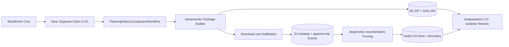

# Architekturpaket Planungshistorien-Kompaktion

Dieses Paket konkretisiert [ADR-0053](../adr/0053-planning-history-compaction.md) für Entwicklung,
Betrieb und Abnahme. Es behandelt ausschließlich unveränderliche Planungsläufe, deren Contexts,
Chunks und Forecast-Snapshots. Operative Zustände, Audit, Idempotenz und Outbox werden nicht
verdichtet.

## Komponenten

Der [Retention- und Restore-Vertrag](retention-and-restore.md) beschreibt Besitz, Fristen,
Forward-Repair und Abnahme. Die betriebliche Ausführung steht im
[Runbook](../../operations/planning-history-compaction.md).

## Nachweise

- SQLite: Baseline plus Migrationen `0002`/`0003`, Trigger, Indizes und kontrollierte Boundary.
- Workflow: deterministische Claims, Paketverifikation, Upload-Retry ohne Überschreiben und
  begrenztes Pruning.
- Restore: Hash-, Mengen-, Boundary- und Fremdschlüsselprüfung in isolierter SQLite-Datenbank.
- Replay: Tagesanalyseformat 1 und Format 2 mit eingebettetem kaltem Paket.
- Last: `npm run test:planning-history-scale` und vollständiger Lauf mit
  `npm run test:planning-history-scale:full`.
