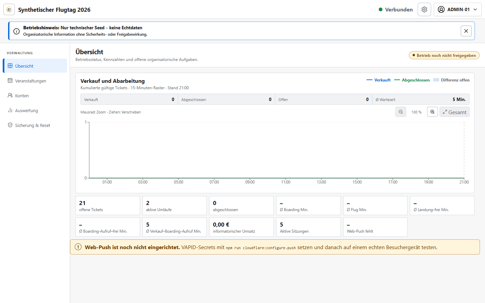

# Einweisung Administration

Version 1.12.0 · Ziel: Veranstaltung, Konten, Stammdaten, Sicherung und Reset kontrolliert verwalten.

## Einstieg

Mit dem Administratorkonto anmelden, Veranstaltung wählen und **Administration** öffnen. Zuerst
Übersicht, Verbindung, offene Warnungen und letzten Sicherungsstand prüfen.

## Kernschritte

1. Veranstaltung, Zeiten, Gates, Ressourcengruppen, Produkte und Flugzeuge vor Betriebsfreigabe prüfen.
2. Pseudonyme Rollen-Konten anlegen; PIN getrennt übergeben und nicht dokumentieren.
3. Betrieb erst nach Rollen-Smoke-Test und Sicherung aktivieren.
4. Berichte, Audit und Backupstatus regelmäßig kontrollieren; keine Warnung still übergehen.
5. Storno, Löschung, Neustart und Werksreset nur mit Begründung, Bestätigung und aktueller Konto-PIN.
6. Nach Werksreset im selben Browser `/setup` fortsetzen; Notfallcode nur bei verlorenem Grant.

## Normalfall

Übersicht → Stammdaten → Konten/Geräte → Smoke-Test → freigeben → sichern

## Stopp/Hilfe holen

- Bei fehlendem Backup, falscher Zielumgebung, D1-/R2-Fehler oder unklarer Migration nichts löschen.
- Eine angebotene Aktualisierung erst ohne geänderte Eingaben oder laufende Administration anwenden;
  danach Versions- und Betriebsstatus erneut prüfen.
- Werksreset, R2-Leerung, Domainwechsel und Produktion benötigen eine zweite verantwortliche Person.
- Bei verlorenem Browser und Grant den Installations-Notfallcode aus dem Passwortsafe verwenden;
  fehlt auch er, Secret bewusst in Cloudflare rotieren.

## Invarianten

- Jede operative Änderung bleibt auditiert; stale writes werden abgelehnt.
- Secrets, PINs, Notfallcode und öffentliche Tokens gehören nie in Logs, Screenshots oder Backups.
- Datenschutz-, Hardware- und Produktionsfreigaben bleiben manuelle Gates.
