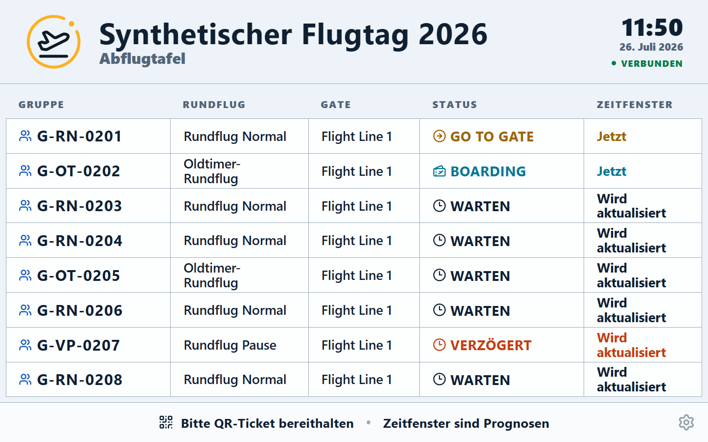

# Einweisung FIDS

Version 1.10.0 · Ziel: den öffentlichen Gruppenstatus ruhig, lesbar und aktuell anzeigen.

## Einstieg

Mit dem FIDS-Konto anmelden, Veranstaltung wählen und **FIDS** öffnen. Browser in Vollbild/Kiosk
setzen; Veranstaltung, Verbindung und sichtbare Zeilen prüfen.

## Kernschritte

1. Richtige Veranstaltung und „Verbunden“ kontrollieren.
2. Lesbarkeit aus typischer Zuschauerentfernung prüfen.
3. In den Einstellungen Zeilenzahl und Ein-/Zweispaltenansicht passend zum Bildschirm wählen.
4. Hinweise wie „zur Flight Line“, Boarding, „im Flug“ und „gelandet“ stichprobenartig abgleichen.
5. Nach Neustart Vollbild, automatische Aktualisierung und Bildschirmsperre erneut prüfen.

## Normalfall

Anmelden → Veranstaltung → Vollbild → Lesbarkeit prüfen → Anzeige beobachten

## Stopp/Hilfe holen

- Bei „Offline“, eingefrorener Anzeige oder falscher Veranstaltung Bildschirm nicht öffentlich lassen.
- Keine Daten per Browserkonsole, URL-Parameter oder fremdem Konto manipulieren.
- Abweichende Gruppenstände an Flight Director melden; FIDS selbst steuert keinen Betrieb.

## Invarianten

- FIDS zeigt Gruppenstatus und prognostische Fenster, keine garantierten Uhrzeiten.
- Es zeigt keine Gastnamen, Telefonnummern oder flugbetrieblichen Freigaben.
- Ein FIDS-Konto öffnet ausschließlich die Anzeige; Einstellungen sind kontogebunden.
