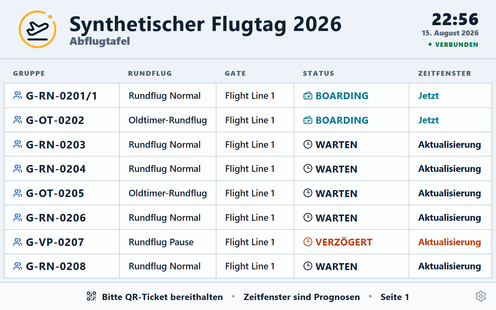

# Einweisung FIDS

Version 1.12.0 · Ziel: den öffentlichen Gruppenstatus ruhig, lesbar und aktuell anzeigen.

## Einstieg

Mit dem FIDS-Konto anmelden, Veranstaltung wählen und **FIDS** öffnen. Browser in Vollbild/Kiosk
setzen; Veranstaltung, Verbindung und sichtbare Zeilen prüfen.

## Kernschritte

1. Richtige Veranstaltung und „Verbunden“ kontrollieren.
2. Lesbarkeit aus typischer Zuschauerentfernung prüfen.
3. In den Einstellungen feste Seite oder Split, Zeilenzahl, Layout, Theme sowie Produkt- und
   Gatefilter passend zum Bildschirm wählen.
4. Hinweise wie „zur Flight Line“, Boarding und `Nachruf aktiv` stichprobenartig abgleichen; beim
   Nachruf müssen Glocke und normaler Gruppenstatus gleichzeitig sichtbar bleiben.
5. Nach Neustart Vollbild, automatische Aktualisierung und Bildschirmsperre erneut prüfen.

## Normalfall

Anmelden → Veranstaltung → Vollbild → Lesbarkeit prüfen → Anzeige beobachten

## Stopp/Hilfe holen

- Bei „Offline“, eingefrorener Anzeige oder falscher Veranstaltung Bildschirm nicht öffentlich lassen.
- Eine angebotene Aktualisierung bewusst anwenden und anschließend Veranstaltung, Vollbild und
  sichtbare Gruppenstände erneut prüfen.
- Keine Daten per Browserkonsole, URL-Parameter oder fremdem Konto manipulieren.
- Abweichende Gruppenstände an Flight Director melden; FIDS selbst steuert keinen Betrieb.

## Invarianten

- FIDS zeigt Gruppenstatus und prognostische Fenster, keine garantierten Uhrzeiten.
- Es zeigt keine Gastnamen, Telefonnummern oder flugbetrieblichen Freigaben.
- Ein FIDS-Konto öffnet ausschließlich die Anzeige; Einstellungen sind kontogebunden.
- Mehrere Geräte desselben Kontos teilen Einstellungen und Filter. Unterschiedliche Seiten werden
  über `page` in der URL eingerichtet; unterschiedliche Filter benötigen getrennte FIDS-Konten.
- `FIXED_PAGE` bleibt auf der URL-Seite. In `SPLIT` enthält der obere Bereich zuerst `BOARDING` und
  `BITTE ZUM GATE`, danach kürzlich abgeflogene Gruppen innerhalb der Nachlaufzeit und anschließend
  `BEREITHALTEN`. Nur der disjunkte untere Bereich wechselt; dessen Überschrift zeigt die Unterseite.
- Die Nachrufglocke pulsiert nur als Zusatzhinweis und ersetzt keinen normalen Status.

## Setup eines Monitors

- FIDS öffnen und im Einstellungsdialog „Setup aktivieren“ wählen.
- Mit den Pfeilen die gewünschte feste URL-Seite einstellen.
- „Link kopieren“ wählen und die kopierte URL als Kiosk-Startseite hinterlegen.
- Setup beenden. Die gemeinsame Kontoauswahl ändert sich dadurch nicht.

Der kopierte Link enthält keinen Setupzustand, keine PIN, Sitzung, Filter oder Kontokennung. Ist die
gewählte feste Seite leer, bleibt ein Leerhinweis sichtbar; im Setup kann direkt zurückgeblättert
werden.

Im Einstellungsdialog bezeichnet „Anzeigeplätze gesamt“ die gesamte physische Zeilenkapazität und
„Oben reservierte Plätze“ die Zielgröße des oberen Bereichs. Der Dialog fasst die daraus folgende
Aufteilung unmittelbar zusammen. Die Nachlaufzeit kürzlich abgeflogener Gruppen ist eine
Veranstaltungseinstellung und wird deshalb nur erläutert, nicht am Display geändert.
