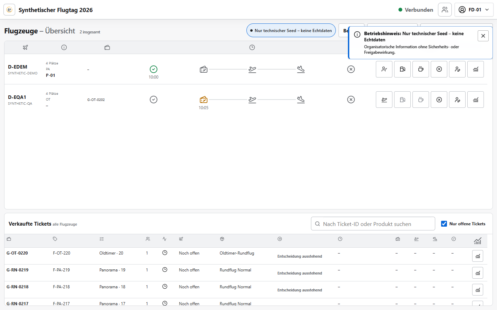

# Einweisung Flight Director

Version 1.11.0 · Ziel: Queue, Flugzeuge und Konflikte übergreifend koordinieren.

## Einstieg

Mit dem Flight-Director-Konto anmelden, Veranstaltung wählen und **Flight Director** öffnen.
„Verbunden“, Veranstaltung und Filter müssen zum aktuellen Betrieb passen.

## Kernschritte

1. Flugzeugübersicht, Betriebszustände und aktive Ressourcenzuordnungen prüfen.
2. Queue und offene Buchungsgruppen beobachten; Nachrufe über die feste Glockenaktion direkt starten
   und über denselben hervorgehobenen Umschalter beenden. Startzeit und Nachrufnummer stehen im
   Tooltip; `NEXT` bleibt eine getrennte bewusste menschliche Entscheidung.
3. Vorschlag, Pilotencode und kompatibles Flugzeug prüfen, danach genau einmal bestätigen.
4. Konflikte oder stale writes neu laden und fachlich neu entscheiden; niemals still überschreiben.
5. Abbruch, Pause, Tanken und Freigabe mit Grund dokumentieren; Historie anschließend kontrollieren.
6. **Auswertungen** öffnet die Tagesverläufe für Fluggruppen, Flugzeuge und anonyme Pilotencodes.
   Das Diagrammsymbol einer Fluggruppe springt direkt in ihren Prognoseverlauf.

## Normalfall

Lage prüfen → Gruppe wählen → Vorschlag prüfen → NEXT bestätigen → Ereignisse beobachten

## Stopp/Hilfe holen

- Bei Doppelzuordnung, falscher Gruppierung, fehlendem Audit oder stale write nicht weiterarbeiten.
- Bei Notfall, globaler Unterbrechung oder unklarer Sicherheitslage örtliche Leitung einschalten.
- Weitreichende Stammdaten-, Lösch- und Resetaktionen an Administration übergeben.

## Invarianten

- Ein Flugzeug gehört gleichzeitig höchstens einer aktiven Ressourcengruppe an.
- Kommunikationsnummern sind stabil, aber weder Uhrzeit noch dauerhafte Flugzeugbindung.
- Der Leitstand schlägt vor; er trifft keine flugbetriebliche oder sicherheitsrelevante Entscheidung.
- Pilotenauswertungen sind organisatorisch und keine Dienst-, Flugzeit- oder Einsatzfreigabe.
- Ein Nachruf verändert weder Queue, Anwesenheit noch Belegung und enthält keine Namen.
