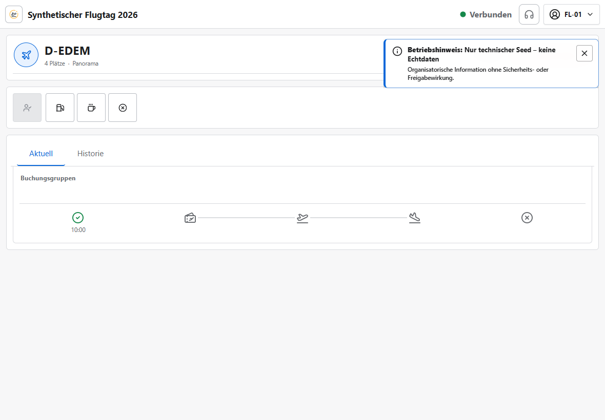

# Einweisung Flight Line

Version 1.11.0 · Ziel: Ereignisse am übernommenen Flugzeug zeitnah und eindeutig melden.

## Einstieg

Mit dem Flight-Line-Konto anmelden, Veranstaltung wählen, **Flight Line** öffnen und genau das
betreute Flugzeug übernehmen.

## Kernschritte

1. Kennzeichen und Ressourcengruppe prüfen; fremde Übernahme nicht ohne Rücksprache erzwingen.
2. Aktuelle Buchungsgruppen lesen; einen Nachruf nur nach Prüfung von Gruppe, Größe, Gate und Text
   starten und den sichtbaren Status `Nachruf aktiv` beachten.
3. Boarding, Off-Block, On-Block/Landung und Verfügbarkeit nur beim tatsächlichen Ereignis melden;
   ein Nachruf verändert diese Zustände nicht.
4. Nach jedem Klick sichtbare Serverbestätigung und aktualisierte Zeitleiste abwarten.
5. Tanken, Pause oder Nichtverfügbarkeit über das passende Symbol melden und Schichtende freigeben.

## Normalfall

Flugzeug übernehmen → Boarding → Off-Block → On-Block → verfügbar

## Stopp/Hilfe holen

- Bei Offlinezustand keine operative Aktion als erledigt annehmen.
- Bei Konflikt, falscher Gruppe, technischem Abbruch oder fremder Übernahme Flight Director holen.
- Notfallmodus nicht für normale Verzögerungen verwenden; örtliches Notfallverfahren geht vor.

## Invarianten

- `GELANDET` bedeutet nicht `VERFÜGBAR`; erst der Abschluss beendet den Turnaround.
- Nach `NEXT` gibt es keine automatische Umbesetzung.
- Tatsächliche Ereignisse treiben die Prognose; keine Zeiten nach Gefühl vor- oder zurückdatieren.
- Der Nachruf verändert Queueposition, Belegung und Anwesenheit nicht.
