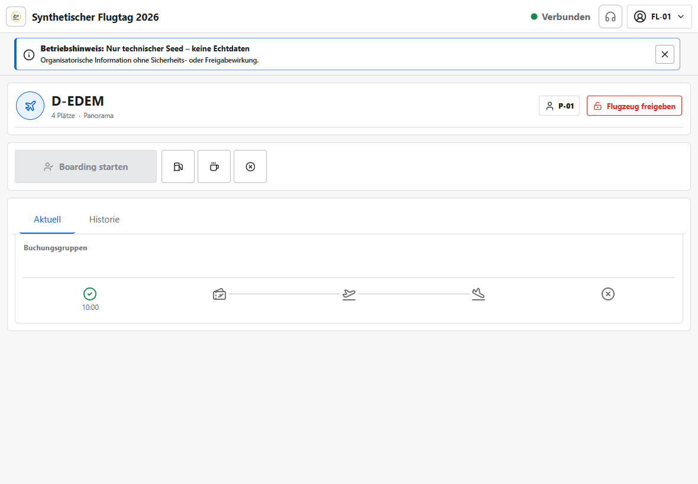

# Einweisung Flight Line

Version 1.12.0 · Ziel: Ereignisse am übernommenen Flugzeug zeitnah und eindeutig melden.

## Einstieg

Mit dem Flight-Line-Konto anmelden, Veranstaltung wählen, **Flight Line** öffnen und genau das
betreute Flugzeug übernehmen. Die Kopfzeile und kompakte Betriebs- oder Updatehinweise bleiben auch
beim Scrollen erreichbar.

## Kernschritte

1. Kennzeichen und Ressourcengruppe prüfen; fremde Übernahme nicht ohne Rücksprache erzwingen.
2. Aktuelle Buchungsgruppen lesen; einen Nachruf nur nach Prüfung von Gruppe, Größe und Gate über
   die Glocke direkt starten. Die hervorgehobene durchgestrichene Glocke zeigt den aktiven Nachruf;
   ihr Tooltip nennt Startzeit und Nachrufnummer, erneutes Betätigen beendet ihn.
3. Den stabil breiten Standardbutton anhand von Icon und sichtbarem Text prüfen und Boarding,
   Off-Block, On-Block/Landung oder Verfügbarkeit nur beim tatsächlichen Ereignis melden; ein Nachruf
   verändert diese Zustände nicht.
4. Nach jedem Klick sichtbare Serverbestätigung und aktualisierte Zeitleiste abwarten.
5. Tanken, Pause oder Nichtverfügbarkeit über das passende Symbol melden. „Flugzeug freigeben“ bleibt
   davon räumlich getrennt und beendet nur die exklusive Bearbeitung durch dieses Flight-Line-Konto.

## Normalfall

Flugzeug übernehmen → Boarding → Off-Block → On-Block → verfügbar

## Stopp/Hilfe holen

- Bei Offlinezustand keine operative Aktion als erledigt annehmen.
- Eine angebotene Aktualisierung nur ohne laufende Aktion anwenden; bei „Nach Abschluss
  aktualisieren“ zuerst die operative Aktion beenden.
- Bei Konflikt, falscher Gruppe, technischem Abbruch oder fremder Übernahme Flight Director holen.
- Notfallmodus nicht für normale Verzögerungen verwenden; örtliches Notfallverfahren geht vor.

## Invarianten

- `GELANDET` bedeutet nicht `VERFÜGBAR`; erst der Abschluss beendet den Turnaround.
- Nach `NEXT` gibt es keine automatische Umbesetzung.
- Tatsächliche Ereignisse treiben die Prognose; keine Zeiten nach Gefühl vor- oder zurückdatieren.
- Der Nachruf verändert Queueposition, Belegung und Anwesenheit nicht.
