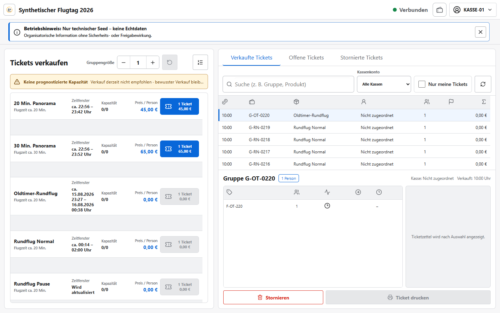

# Einweisung Kasse

Version 1.12.0 · Ziel: sicher und zügig Tickets für eine verbundene Buchungsgruppe verkaufen.

## Einstieg

Mit dem Kassenkonto anmelden, Veranstaltung wählen und die Ansicht **Kasse** öffnen. Oben müssen
„Verbunden“ und der richtige Veranstaltungstag stehen; dauerhafte Betriebs- und Updatehinweise
erscheinen direkt unter der Kopfzeile.

## Kernschritte

1. Richtigen Rundflug, Kapazitätsstatus und den aktuellen Hinweis zum Zeitfenster prüfen. Eine reine
   Verkaufsempfehlung ist keine Verkaufssperre.
2. Personenzahl einstellen; eine angezeigte Aufteilung bleibt eine verbundene Buchungsgruppe.
3. Gewichtsklasse nur als organisatorischen Hinweis erfassen.
4. Preis und Gruppe nochmals lesen, dann den blauen Ticketbutton genau einmal wählen.
5. Serverbestätigung abwarten, Ticketgruppe auswählen und Ticket drucken oder QR-Code übergeben.

## Normalfall

Produkt prüfen → Personenzahl → verkaufen → Bestätigung → Ticket ausgeben

## Stopp/Hilfe holen

- Bei „Offline“, „Verbindung getrennt“, Konflikt oder unklarer Serverantwort nicht erneut verkaufen.
- „Jetzt aktualisieren“ nur ohne geändertes Formular oder laufenden Schreibvorgang wählen; andernfalls
  den sichtbaren Hinweis „Nach Abschluss aktualisieren“ beachten.
- Storno, Umbuchung oder falsche Gruppe nur über den vorgesehenen Dialog und mit Begründung.
- Bei Preis-, Kapazitäts- oder Gruppenabweichung Flight Director oder Administration holen.

## Invarianten

- Gruppen werden nie automatisch getrennt; ein Ticket gehört höchstens zu einem offenen Umlauf.
- Zeitfenster sind Prognosen, keine garantierten Uhrzeiten.
- Gewichtshinweise besitzen keine Freigabewirkung; keine Gastnamen oder Telefonnummern erfassen.
