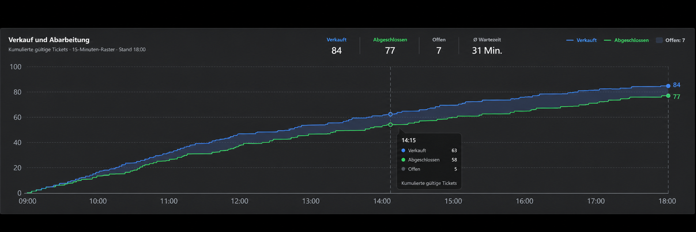
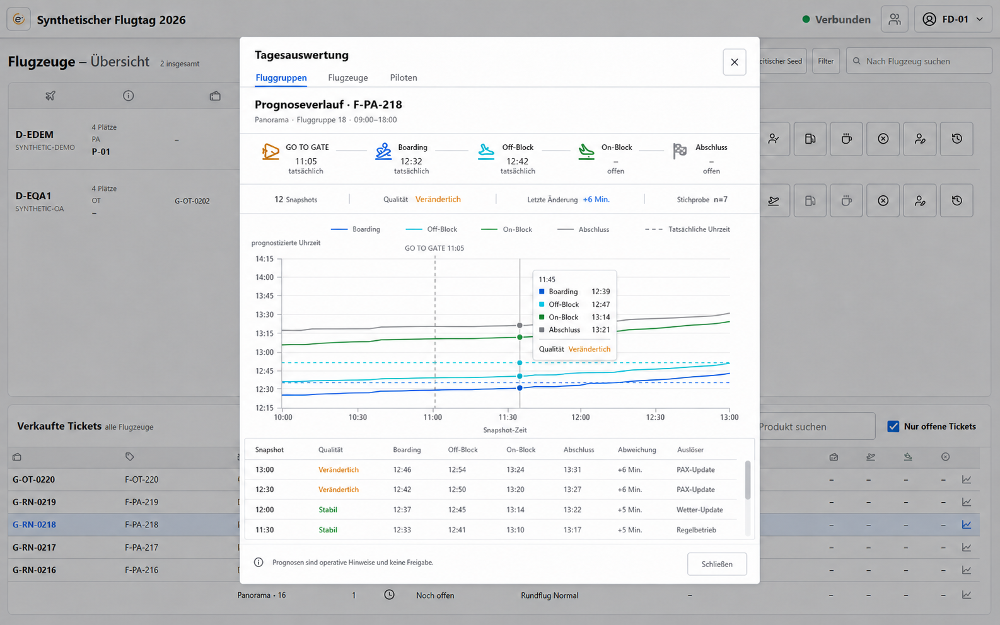
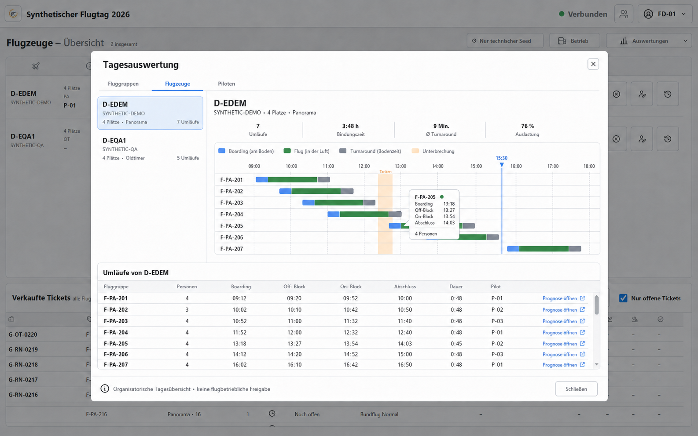
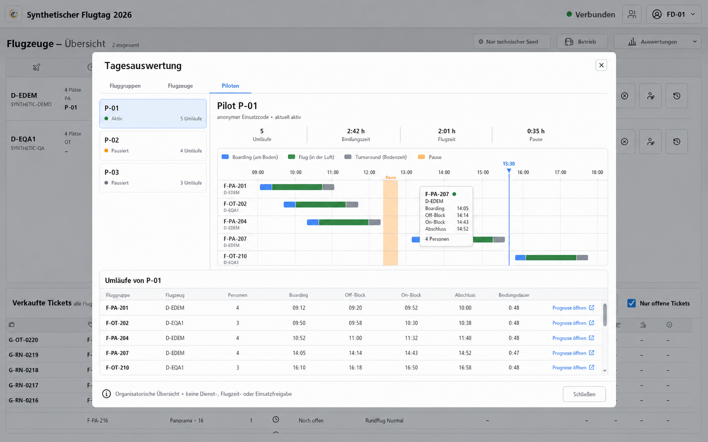

# Flight-Director-Tagesauswertung

Stand: 30. Juli 2026 · Freigegebene Ergänzung zum Releasekonzept 1.11.0

## Ziel und Abgrenzung

Die Ein-Bildschirm-Oberfläche des Flight Directors bleibt erhalten. Zusätzliche Statistiken werden
ausschließlich über den sekundären Kopfbutton **Auswertungen**, das Diagrammsymbol einer
Flugzeugzeile oder das Diagrammsymbol einer verkauften Fluggruppe geöffnet.

Die Auswertung gilt nur für die aktuelle Veranstaltung. Sie trifft keine flugbetriebliche,
sicherheitsrelevante, dienstzeitrechtliche oder luftrechtliche Entscheidung. Piloten werden
ausschließlich mit ihrem anonymen operativen Code dargestellt.

## Freigegebene Darstellungen

### Administration: Verkauf und Abarbeitung

- Recharts-Stufenkurven mit 1,75 Pixel Linienstärke
- verkauft und abgeschlossen als kumulierte Linien
- offene Tickets als Fläche zwischen beiden Kurven
- aktueller Stand, Tooltip und feste Höhe ohne Layoutsprung
- Kennzahlen für verkauft, abgeschlossen, offen und durchschnittliche Wartezeit

### Fluggruppen

- vier Prognoselinien für Boarding, Off-Block, On-Block und Abschluss
- bestätigte Ist-Zeiten als gestrichelte Referenzen
- GO-TO-GATE-Zeitpunkt als vertikale Referenz
- Snapshot-Zahl, Qualität, letzte Boarding-Änderung und Datenbasis
- paginierte Snapshot-Tabelle

### Flugzeuge

- horizontale Zeitachse mit Boarding-, Flug- und Turnaround-Segmenten
- überlagerte Tanken-, Pausen- und Unterbrechungsintervalle
- bestätigte Umläufe, Bindungszeit, Turnaround und Sitzauslastung
- Sprung vom Umlauf zum zugehörigen Prognoseverlauf

### Piloten

- ausschließlich operative Pilotencodes
- Umläufe, Bindungszeit, gemessene Flugzeit und erfasste Pausenzeit
- Zeitachse mit zugeordnetem Flugzeug
- fester Hinweis: „Organisatorische Übersicht · keine Dienst-, Flugzeit- oder Einsatzfreigabe.“

## Gemeinsamer Diagramm-Viewport

Prognose-, Flugzeug- und Pilotendiagramme verwenden denselben festen äußeren Viewport. Nur die
innere Zeichenfläche wird vergrößert und horizontal bewegt; Rahmen, rechte Außenkante,
Zoomsteuerung und Scrollbereich bleiben dadurch stabil. Das Mausrad zoomt an der Zeigerposition,
Ziehen mit der primären Maustaste verschiebt die Zeitachse, und **Gesamt** setzt Zoom,
Scrollposition und Ziehzustand gemeinsam zurück. Auswahl- und Reiterwechsel beginnen ebenfalls
immer in der Gesamtansicht.

Die X-Achsen verwenden explizit berechnete, an lokalen Zeitgrenzen der Veranstaltungszeitzone
ausgerichtete Ticks. Abhängig von Zeitspanne, Viewportbreite und Zoom werden ausschließlich die
Stufen 5, 10, 15, 30, 60, 120, 180, 360 oder 720 Minuten verwendet; feinere Ticks als fünf Minuten
werden nicht erzeugt. Höhere Zoomstufen zeigen schrittweise mehr Zeitdetails, ohne
Beschriftungsüberlagerungen.

Flugzeug- und Pilotendiagramme zeigen auf kurzen aufeinanderfolgenden Umläufen keine permanenten
Gruppenlabels. Jeder farbige Ressourcenbalken bleibt fokussierbar und öffnet per Klick oder
Tastatur den Prognoseverlauf. Sein zugänglicher Name und Tooltip enthalten alle zugehörigen
Ticketgruppen, die Fluggruppe, Boarding und Abschluss, Personen/Kapazität, Flugzeugkennung und
Pilotencode.

## Daten- und Sicherheitskonzept

`GET /api/control/:eventId/history/resources` ist eine interne, read-only Route für `ADMIN` und
`FLIGHT_DIRECTOR`. Sie akzeptiert genau `AIRCRAFT` oder `PILOT` sowie eine gebundene Ressourcen-ID.
Die Antwort enthält ausschließlich normalisierte Umläufe, Kapazitätswerte, andere operative
Ressourcencodes und Blockintervalle.

Gründe, Notizen, Gastdaten, öffentliche Ticketcodes und Tokens werden weder abgefragt noch
ausgegeben. Flugzeugintervalle stammen aus `operational_blocks`. Pilotenpausen werden
deterministisch aus den append-only Ereignissen `PILOT_PAUSE_STARTED` und `PILOT_PAUSE_ENDED`
gebildet; offene Intervalle enden am Beobachtungszeitpunkt. Eine Datenbankmigration ist nicht
erforderlich.

Die bestehende Prognosehistorie bleibt unverändert. Der Browser lädt ihre Seiten zu je höchstens
200 Snapshots vollständig und verwirft Antworten, die zu einer inzwischen veralteten Auswahl
gehören. Der umfangreiche Dialog einschließlich Recharts wird erst beim Öffnen nachgeladen.
