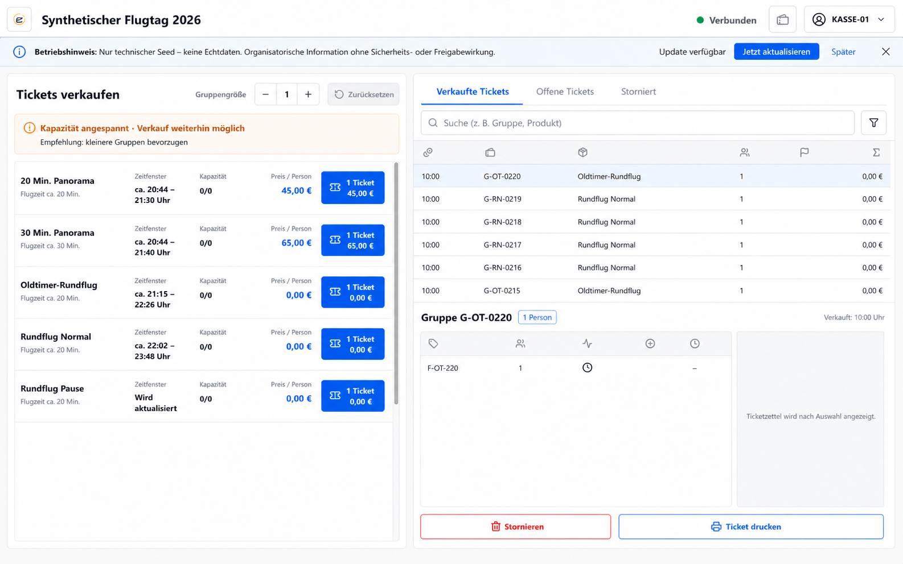
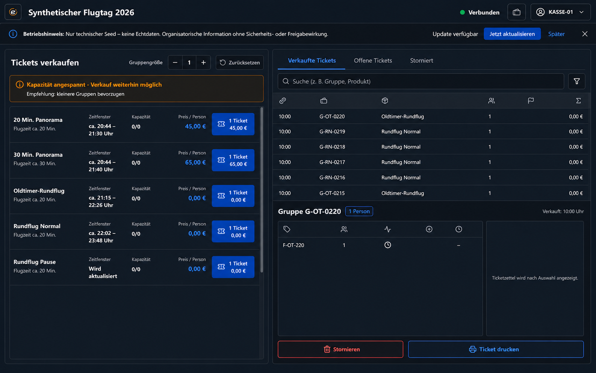
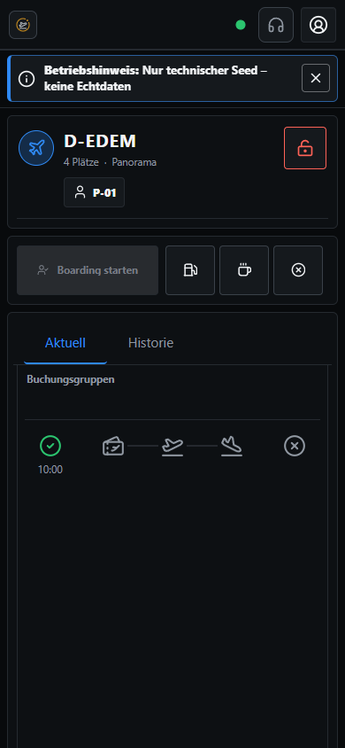
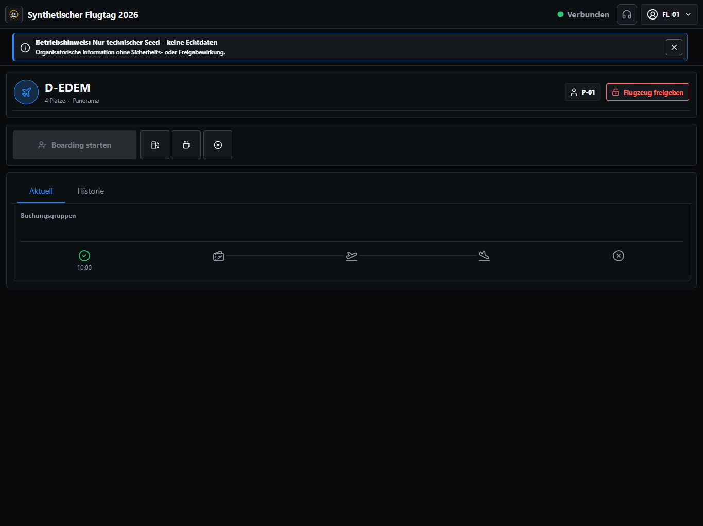
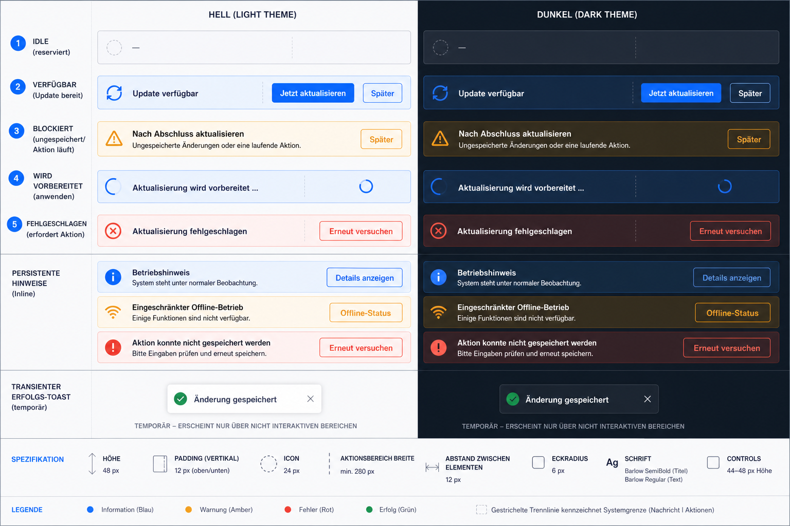
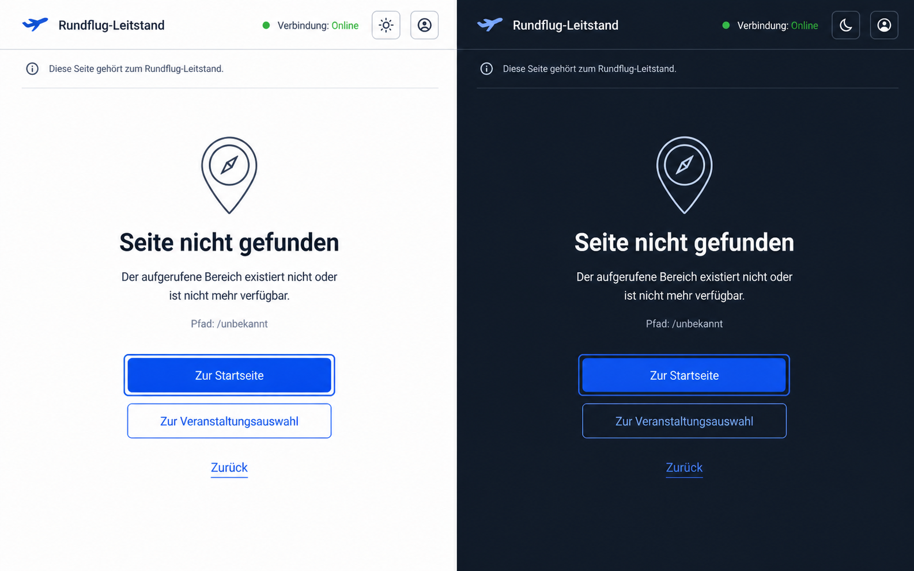

# Konzept: operative UI-Sicherheit und stabile Meldungsflächen

- Status: Freigegeben
- Stand: 2026-08-15
- Freigabe: Auftraggeber, 2026-08-15
- Branch: `feat/operational-ui-safety`
- Betroffene Anforderungen: F-KAS-100, F-KAP-020, F-KAP-050, V16-KAS-020,
  V191-CAS-010, Q-UX-010, Q-UX-020, Q-UX-040

## Ziel und fortgeltende Struktur

Das Konzept ergänzt die bestehenden Ein-Bildschirm-Abläufe von Kasse, Flight Line und Flight
Director. Es führt kein Karten-Dashboard, keine neue fachliche Freigabe und keine automatische
Disposition ein. Die vorhandene Informationsarchitektur, das Iconsystem, die Modulidentitäten und
die Rollenbezeichnungen bleiben fortgeltend.

Die generierten Bilder spezifizieren Hierarchie, Fluchten, Dichte, Zustandsflächen und
Light-/Dark-Farbwirkung. Wo ein Bild vereinfachte Beispieldaten zeigt, gelten die vorhandenen
Produktionsverträge und die nachfolgende Copy- und Komponentenliste. Insbesondere bleibt das
angemeldete Flight-Line-Konto im App-Header `FL-01`; der anonyme Pilotencode `P-01` gehört in den
Flugzeugbereich.

## Kasse

Die linke Spalte bleibt der stabile Verkaufsbereich. Zwischen Überschrift/Gruppenzähler und
Produktliste liegt genau eine reservierte Empfehlungszeile. Sie zeigt `capacityStatus` mit Text und
Symbol sowie `saleRecommended` als Empfehlung. `saleRecommended === false` deaktiviert den Verkauf
nicht; ausschließlich bestehende fachliche Hard Guards dürfen eine Verkaufsaktion sperren.

Die rechte Spalte behält Tabs, Suche, Tabelle, Ticketdetail und feste Footeraktionen. Lade-,
Filter-, Pending- und Auswahlwechsel verändern weder die Spaltenbreiten noch die Position der
Footeraktionen. Jede Liste besitzt genau einen begrenzten Scrollbereich.

Die in den Bildern sichtbaren 20- und 30-Minuten-Werte dokumentieren ausschließlich den korrigierten
synthetischen Seed. Dafür wird weder ein neues UI-Element noch eine zusätzliche Zusammenfassung oder
Belegdarstellung eingeführt. Die bestehende Produktdarstellung liest weiterhin unverändert
`promisedFlightMinutes`; ein ausgeführter Datenbank-/API-Modelltest schützt die Seed-Korrektur.

## Flight Line

Die beiden durch den Auftraggeber bereitgestellten produktionsnahen Screenshots sind die verbindliche
visuelle Referenz. Das bestehende Bestandsdesign wird nicht neu interpretiert. Geräte- und
Browserchrom der Originalaufnahmen werden aus Datenschutzgründen nicht im Repository versioniert;
die folgenden Abbildungen stammen aus der synthetischen lokalen Testinstanz.

Die einzige Änderung an der vorhandenen Flight-Line-Aktionsreihe ist das Textlabel im ersten,
zustandsabhängigen Standard-Button. Die folgenden Varianten illustrieren diese additive Änderung;
für alle übrigen Pixel, Abstände und Controls bleiben die Bestandsreferenzen maßgeblich.

Der erste Button zeigt weiterhin sein bestehendes Icon und zusätzlich das dauerhaft sichtbare
deutsche Zustandslabel, beispielsweise `Boarding starten`, `Off-Block`, `On-Block`,
`Umlauf abschließen` oder `Verfügbar setzen`. Er erhält pro Breakpoint eine feste Breite und eine
feste Höhe, die nicht vom aktuellen Label, Disabled-, Pending- oder Fehlerzustand abhängen. Für lange
Labels ist innerhalb dieses festen Slots ein kontrollierter zweizeiliger Textbereich reserviert.
Dadurch bleiben die drei nachfolgenden Icon-Buttons und alle Fluchten beim Zustandswechsel exakt an
derselben Position.

Alle drei nachfolgenden Icon-Buttons, Flugzeugkopf, Pilotenbereich, Tabs, Timeline, Farben, Abstände
und Controlhöhen bleiben unverändert. Es werden keine zusätzlichen Textlabels an die sekundären
Flight-Line-Buttons gesetzt.

`Flugzeug freigeben` bleibt exakt an seiner heutigen Position im Flugzeugkopf. Die Funktion beendet
nur die exklusive Bearbeitungsübernahme des aktuellen Flight-Line-Mitarbeiters und erzeugt keine
fachliche Statusänderung am Flugzeug. Sie wird weder in die operative Aktionsreihe verschoben noch
mit `Verfügbar setzen` zusammengeführt.

## Flight Director

Auch beim Flight Director bleibt die bestehende Oberfläche strukturell erhalten. Die im Programm
vorgesehene Beschriftung der zustandsabhängigen Standardaktion ergänzt lediglich das vorhandene Icon;
sekundäre Controls, Informationsdichte und Fluchten bleiben unverändert.

## Mobile Kopfzeile und Hinweisplatzierung

Auf iPhone-Viewports bleibt der bestehende globale App-Header in Kasse, Flight Line und Flight
Director beim vertikalen Scrollen dauerhaft am oberen Rand sichtbar. Sein Aussehen und seine
Controlanordnung werden nicht verändert. Er berücksichtigt `env(safe-area-inset-top)`, besitzt den
heutigen deckenden Hintergrund und liegt über dem scrollenden Inhalt. Seine Höhe bleibt bei
Verbindungs-, Konto- und Ladezustandswechseln stabil.

Persistente Betriebs-, Offline-, Fehler- und Updatezustände erhalten unmittelbar unter dem App-Header
genau eine kompakte Hinweiszeile. Die folgende Darstellung zeigt ausschließlich die Platzierung in
der Flight-Line-Bestandsoberfläche; sie führt keine weitere Änderung an dieser Oberfläche ein.

Solange ein solcher Zustand aktiv ist, bilden App-Header und Hinweiszeile einen stabilen Sticky-Stack.
Die Hinweiszeile belegt einen festen Layout-Slot, schiebt den Inhalt nach unten und überdeckt keine
Arbeitsfläche. Ihre Höhe ändert sich beim Wechsel zwischen Hinweisarten nicht. Im Normalzustand bleibt
das heutige Bestandslayout ohne leere Hinweisfläche sichtbar.

Es wird niemals ein Bannerstapel aufgebaut. Die Zeile zeigt den höchstpriorisierten Zustand und fasst
weitere Zustände über eine kompakte Anzahl mit zugänglicher Detailansicht zusammen. Die Priorität ist:
Fehler oder Konflikt, Offline/Betriebshinweis, blockiertes Update, verfügbares Update. Ein Update wird
bei gleichzeitigem Betriebsproblem in der Detailansicht zurückgestellt.

Die Updatezeile bietet `Jetzt aktualisieren` und `Später`. Bei Dirty-Formularen oder laufenden
Schreibkommandos lautet der Zustand `Nach Abschluss aktualisieren`; ein Reload ist dann technisch
gesperrt. Dialoge und modale Overlays liegen weiterhin über dem Sticky-Stack. Ein dazu passendes
`scroll-padding-top` verhindert, dass angesprungene oder fokussierte Controls darunter verborgen
werden.

Marke, Veranstaltung, Verbindungsstatus und angemeldetes Konto bleiben sichtbar. Wenn der Platz
knapp wird, wird ausschließlich der Veranstaltungstitel einzeilig mit Ellipse gekürzt; interaktive
Controls verschwinden nicht und behalten mindestens 44 Pixel große Touchziele. Die Flight-Line-Aktion
`Flugzeug freigeben` verbleibt im scrollenden Flugzeugkontext und wird nicht in den globalen Header
verschoben.

## Update- und Meldungsmodell

Der PWA-Updatezustand ist intern als `idle | available | blocked | applying | failed` modelliert:

| Zustand | Sichtbares Verhalten |
| --- | --- |
| `idle` | Keine Hinweiszeile; das heutige Bestandslayout bleibt unverändert. |
| `available` | `Update verfügbar` mit `Jetzt aktualisieren` und `Später`. Kein automatischer Reload. |
| `blocked` | `Nach Abschluss aktualisieren`; Dirty-Form oder laufendes Schreibkommando verhindert den Reload. |
| `applying` | `Aktualisierung wird vorbereitet …`; nur der Aktionsslot zeigt Pending. |
| `failed` | `Aktualisierung fehlgeschlagen` mit `Erneut versuchen`; die Anwendung bleibt bedienbar. |

Eine zentrale Dirty-/Pending-Registry nimmt tokenbasierte Registrierungen auf, damit mehrere
Formulare oder Schreibkommandos einander nicht versehentlich entsperren. Erst wenn alle Tokens
entfernt sind, darf ein bewusst angefordertes, zuvor blockiertes Update angewandt werden.

Persistente Betriebs-, Offline-, Konflikt- und Fehlermeldungen nutzen dieselbe priorisierte
Hinweisregion. Auf iPhone-Viewports ist sie bei aktivem Zustand Teil des beschriebenen Sticky-Stacks;
auf größeren Viewports bleibt sie eine reservierte Inline-Region unter dem Screen-Header. Sie
überdeckt keine Controls. Nur kurzlebige, nicht handlungsbedürftige Erfolgsbestätigungen dürfen als
Toast über einem nicht interaktiven Randbereich erscheinen. Fokus wird weder automatisch auf einen
Toast verschoben noch von einem aktiven Control entfernt.

## Unbekannte Routen

Ein unbekannter Frontendpfad rendert eine eigene `NotFoundPage`. Er fällt nicht auf `/cashier`
zurück und mountet weder Kassen- noch Event-Workspace-Datenhooks. Sichtbare Copy:

- `Seite nicht gefunden`
- `Der aufgerufene Bereich existiert nicht oder ist nicht mehr verfügbar.`
- `Pfad: {pathname}` ohne Query, Hash oder sensible Werte
- `Zur Startseite`
- `Zur Veranstaltungsauswahl`
- `Zurück`

Die Rückwege berücksichtigen den Authentisierungs- und Veranstaltungskontext. Ein SPA-
Dokumentrequest kann technisch HTTP 200 liefern; unbekannte `/api/*`-Routen bleiben echte 404.

## Designsystem und Geometrie

- Bestehende Barlow-/Barlow-Condensed-Typografie und bestehendes Rundflug-Leitstand-Iconsystem.
- Keine Gradients, Glows, Glasflächen oder dekorativen Illustrationen.
- Light: echtes Weiß und kühle helle Grauflächen; Dark: neutrale tiefblaue/anthrazitfarbene
  Flächen ohne eingefärbten Overlay.
- Blau bleibt Interaktion/Information; Grün Erfolg/Verbindung; Amber Warnung/Blockierung; Rot Fehler
  oder destruktive Aktion. Farbe erhält immer Text oder Symbol.
- Controls mindestens 44 Pixel, touchkritische operative Aktionen 56 Pixel hoch.
- Radius 6 Pixel für Meldungs- und Controlflächen; Schatten nur, wenn er bereits zur vorhandenen
  App-Shell gehört.
- 12-Pixel-Basisabstand innerhalb kompakter Controls; 16/24 Pixel zwischen funktionalen Regionen.

## Verbindliche Abnahme-Viewports

| Oberfläche | Viewport | Themen |
| --- | ---: | --- |
| Kasse | 1440 × 900, 1194 × 679, 820 × 1180, 390 × 844 | Hell, Dunkel |
| Flight Line | 1440 × 900, 1194 × 679, 430 × 900, 390 × 844 | Hell, Dunkel |
| Flight Director | 1440 × 900, 1194 × 679, 390 × 844 | Hell, Dunkel |
| Not-found | 1440 × 900, 390 × 844 | Hell, Dunkel |

Geprüft werden zusätzlich Dirty-/Pending-Updateblockierung, Tastaturreihenfolge, die rein technische
Seed-/API-Modellkorrektur ohne neues Dauer-UI, reine Empfehlung ohne Verkaufssperre, die
statusneutrale Übernahmefreigabe außerhalb der operativen Flight-Line-Aktionsreihe, fehlende
Kassenrequests auf unbekannten Pfaden, API-404, genau ein Scroll-Eigentümer je Liste und stabile
Primäraktionspositionen. Für Kasse, Flight Line und Flight Director wird auf 390 × 844 zusätzlich
nach mindestens 600 Pixel vertikalem Scrollweg geprüft, dass der App-Header an der Safe-Area-Kante
sichtbar bleibt und keinen fokussierten Inhalt verdeckt. Mit aktivem Hinweis wird zusätzlich geprüft,
dass genau eine Hinweiszeile direkt unter dem App-Header sticky bleibt, keine Arbeitsfläche überdeckt
und beim Wechsel zwischen Betriebs-, Offline-, Fehler- und Updatezuständen weder ihre Höhe noch die
Breite und Position der Flight-Line-Standardaktion verändert.

## Freigabe

Die visuelle Richtung wurde am 2026-08-15 durch den Auftraggeber freigegeben. Verbindlich sind dabei
insbesondere die unveränderte Flight-Line-Bestandsstruktur, das additive Textlabel im festen Slot,
die separat verbleibende Übernahmefreigabe sowie der Sticky-Stack aus Kopfzeile und genau einer
kompakten Hinweisfläche. Abweichungen benötigen einen dokumentierten technischen Grund oder eine
erneute Freigabe.
